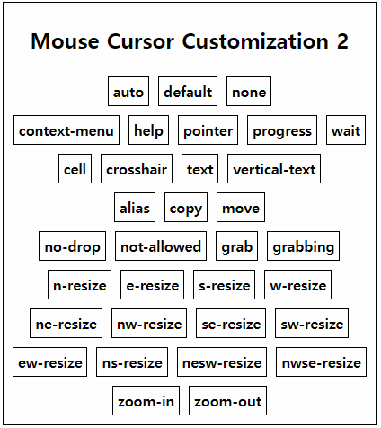
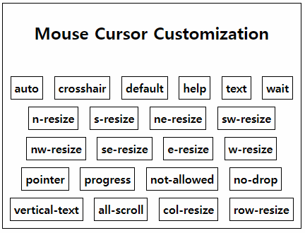

# [My CSS Practice](../README.md#css)

Codes where CSS was the focus, although it's practically impossible to completely separate it from other web languages


### \<List>

- [Mouse Cursor Customization 2 (2023.02.06)](#mouse-cursor-customization-2-20230206)
- [Mouse Cursor Customization (2023.01.29)](#mouse-cursor-customization-20230129)


## [Mouse Cursor Customization 2 (2023.02.06)](#list)

- Advanced code from [Mouse Cursor Customization (2023.01.29)](#mouse-cursor-customization-20230129)
  - Refine repetitive codes by *JavaScript* : use `.createElement()` `.style.cursor` `.appendChild()`
  - Update keywords from the reference : [[mdn web docs] References > CSS > cursor](https://developer.mozilla.org/en-US/docs/Web/CSS/cursor)
- Future tasks : Move the cursor by *AutoHotKey* automatically

  

- Codes
  <details>
    <summary>Cursor2.html (mainly changed)</summary>

  ```html
      <head>
          ……
          <script defer src="./Cursor2.js" type="text/javascript"></script>
          ……
      </head>
  ```
  ```html
      <body>
          <div id="box">
              <h2>Mouse Cursor Customization 2</h2>
              <!-- Elements will be added by js -->
          </div>
          ……
      </body>
  ```
  </details>
  <details>
    <summary>Cursor2.css (mainly changed)</summary>

  ```css
  /* All blocks for classes related with cursor have been removed in CSS file. */
  ```
  </details>
  <details>
    <summary>Cursor2.js (new)</summary>

  ```js
  // Declare an array of kewords for cursor property
  // Reference ☞ https://developer.mozilla.org/en-US/docs/Web/CSS/cursor
  var cursorTypes = [
      ["auto", "default", "none"],
      ["context-menu", "help", "pointer", "progress", "wait"],
      ["cell", "crosshair", "text", "vertical-text"],
      ["alias", "copy", "move"],
      ["no-drop", "not-allowed", "grab", "grabbing"],
      ["n-resize", "e-resize", "s-resize", "w-resize"],
      ["ne-resize", "nw-resize", "se-resize", "sw-resize"],
      ["ew-resize", "ns-resize", "nesw-resize", "nwse-resize"],
      ["zoom-in", "zoom-out"]
  ]

  // A function to generate span elements with inner text and cursor style
  function genBoxes(cursorTypes)
  {
      // Declare an object to indicate the element where new elements will be appended
      var obj = document.getElementById("box")

      // Loop for the array cursorTypes
      for (r in cursorTypes)
      {
          for (el in cursorTypes[r])
          {
              // Test : ok
              // console.log(cursorTypes[r][el])

              // Generate a box with style
              var newBox = document.createElement("span")
              // newBox.className = cursorTypes[r][el]                            // not needed
              newBox.innerText = cursorTypes[r][el]
              newBox.style.cursor = cursorTypes[r][el]

              // Append it
              obj.appendChild(newBox)
          }

          // Line replacement
          var br = document.createElement("br")
          obj.appendChild(br)
      }
  }

  // Run
  genBoxes(cursorTypes)
  ```
  </details>


## [Mouse Cursor Customization (2023.01.29)](#list)

- A practice to customize mouse cursor figure in web
- Reference  
  : [[Sololearn] CSS > Properties> 34. Customizing the Mouse Cursor > The cursor Property Values](https://www.sololearn.com/learning/1023/1110/1291/1)
- Future tasks  
  · Refine repetitive codes by *JavaScript* or such → [(done)](#mouse-cursor-customization-2-20230206)  
  · Move the cursor by *AutoHotKey* automatically

  

- Codes
  <details>
    <summary>Cursor.html</summary>

  ```html
  <!DOCTYPE html>

  <html lang="en">

      <head>
          <meta charset="utf-8">
          <title>Mouse Cursor Customization</title>
          <meta name="author" content="kimpro82">
          <link rel="stylesheet" href="./Cursor.css">
      </head>

      <body>
          <div id="box">
              <h2>Mouse Cursor Customization</h2>

              <br>

              <span class="auto">auto</span>
              <span class="crosshair">crosshair</span>
              <span class="default">default</span>
              <span class="help">help</span>
              <span class="text">text</span>
              <span class="wait">wait</span>

              <br>

              <span class="n-resize">n-resize</span>
              <span class="s-resize">s-resize</span>
              <span class="ne-resize">ne-resize</span>
              <span class="sw-resize">sw-resize</span>
              
              <br>

              <span class="nw-resize">nw-resize</span>
              <span class="se-resize">se-resize</span>
              <span class="e-resize">e-resize</span>
              <span class="w-resize">w-resize</span>

              <br>

              <span class="pointer">pointer</span>
              <span class="progress">progress</span>
              <span class="not-allowed">not-allowed</span>
              <span class="no-drop">no-drop</span>

              <br>

              <span class="vertical-text">vertical-text</span>
              <span class="all-scroll">all-scroll</span>
              <span class="col-resize">col-resize</span>
              <span class="row-resize">row-resize</span>
          </div>

          <br>
          &nbsp;                                              <!-- to stay cursor when capture -->
      </body>

  </html>
  ```
  </details>
  <details>
    <summary>Cursor.css</summary>

  ```css
  @charset "EUC-KR";

  body
  {
      font-weight: bold;
  }

  #box
  {
      text-align: center;
      display: inline-block;
      border: 1px solid;
      padding: 5px;
      margin: 5px;
  }

  span
  {
      display: inline-block;
      border: 1px solid;
      padding: 5px;
      margin: 5px;
  }

  .auto           { cursor: auto;         }
  .crosshair      { cursor: crosshair;    }
  .default        { cursor: default;      }
  .help           { cursor: help;         }
  .text           { cursor: text;         }
  .wait           { cursor: wait;         }

  .n-resize       { cursor: n-resize;     }
  .s-resize       { cursor: s-resize;     }
  .ne-resize      { cursor: ne-resize;    }
  .sw-resize      { cursor: sw-resize;    }
  .nw-resize      { cursor: nw-resize;    }
  .se-resize      { cursor: se-resize;    }
  .e-resize       { cursor: e-resize;     }
  .w-resize       { cursor: w-resize;     }

  .pointer        { cursor: pointer;      }
  .progress       { cursor: progress;     }
  .not-allowed    { cursor: not-allowed;  }
  .no-drop        { cursor: no-drop;      }
  .vertical-text  { cursor: vertical-text;}
  .all-scroll     { cursor: all-scroll;   }
  .col-resize     { cursor: col-resize;   }
  .row-resize     { cursor: row-resize;   }
  ```
  </details>
