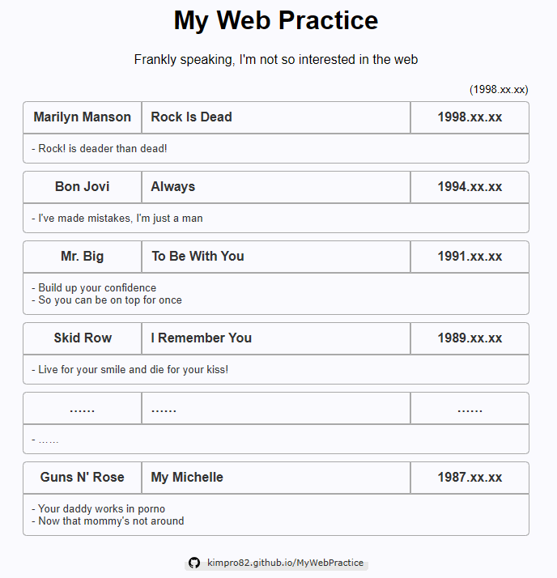
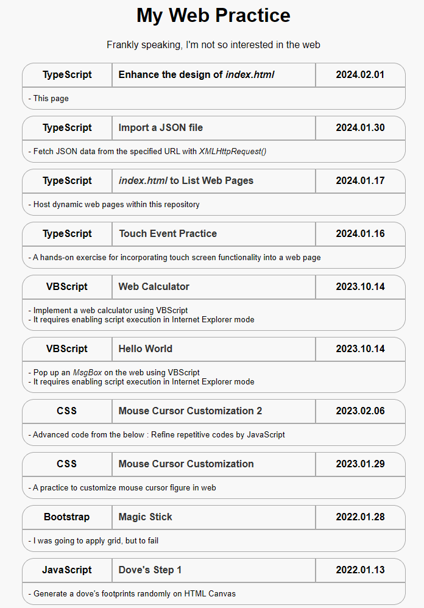
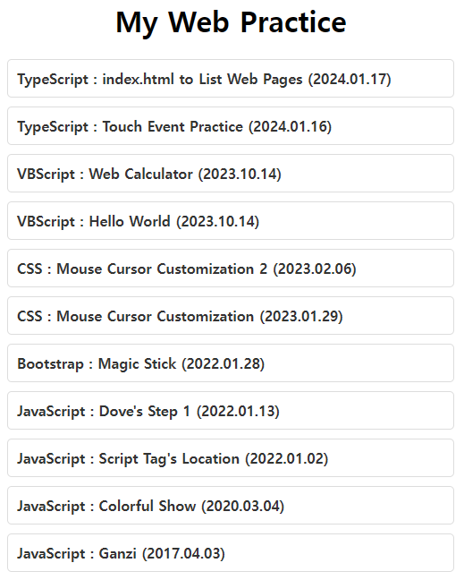

# [Web Hosting](../README.md#※-web-hosting)

Creating a hosting page to demonstrate the actual operation of practice codes …… has become quite a separate project???


### \<List>

- [`index.html` 3.1: Fix Error *404 Not Found* (2024.02.19)](#indexhtml-31-fix-error-404-not-found-20240219)
- [`index.html` 3: Enhance the Code Structure and the Design (2024.02.17)](#indexhtml-3-enhance-the-code-structure-and-the-design-20240217)
- [`index.html` 2: Enhance the Design (2024.02.01)](#indexhtml-2-enhance-the-design-20240201)
- [`index.html` to Host Web Pages (2024.01.17)](#indexhtml-to-host-web-pages-20240117)


## [`index.html` 3.1: Fix Error *404 Not Found* (2024.02.19)](#list)

- Why error?
  - The absolute path `/` in this repository indicates `https://{owner}.github.io/`, not `https://{owner}.github.io/{repo}/`
  - So `/{directory}` is going to request `https://{owner}.github.io/{directory}`, not `https://{owner}.github.io/{repe}/{directory}`, which causes an 404 error
  - This differs from the meaning of `/` in `README.md`!
- Fix paths
  - All `/{directory}` to `./{directory}` in `/index.html`
  - All `/{directory}` to `../{directory}` in `/Hosting/links.json` and so on
- Code and Result
  <details>
    <summary>/index.html (changed)</summary>

  ```html
      ……
      <meta http-equiv="refresh" content="0;url=./Hosting/index.html">  
      ……
  ```
  </details>
  <details>
    <summary>links.json and so on (changed)</summary>

  ```json
      ……
      "url": "../Hosting/index_20240201.html",
      ……
  ```
  </details>


## [`index.html` 3: Enhance the Code Structure and the Design (2024.02.17)](#list)

- Features
  - Apply `<a>` tags to the entire scope of the `<table>`
  - Add the last updated date
  - Add some footer information
  - Improve the directory structure related the hosting page
- Code and Result

  

  <details>
    <summary>index_20240116.html → /index.html (copied & changed)</summary>

  ```html
  ……
      <meta http-equiv="refresh" content="0;url=/Hosting/index.html">
      <title>(just for redirecting)</title>
  ……
  ```
  </details>
  <details>
    <summary>index.html (changed)</summary>

  ```html
  ……

  <body>
    <!-- Header section with h1 element -->
    <div>
      <h1>My Web Practice</h1>
      <!-- Introductory text -->
      Frankly speaking, I'm not so interested in the web
    </div>

    <!-- Container for the recent update date -->
    <div class="date-container" id="dateContainer"></div>

    <!-- Container for links -->
    <div class="links-container" id="linksContainer"></div>

    <!-- Footer section -->
    <footer>
      <p>
        <!-- GitHub link with badge -->
        <a href="https://github.com/kimpro82/MyWebPractice/" target="_blank">
          
        </a>
      </p>
    </footer>
  </body>

  ……
  ```
  </details>
  <details>
    <summary>styles.css (changed)</summary>

  ```css
  /* Styling for date-container element with right alignment */
  .date-container {
    margin-top: 20px;                     /* Add top margin */
    text-align: right;                    /* Align text to the right */
    width: 94.5%;                         /* Set width */
    font-size: smaller;                   /* Set smaller font size */
  }
  ```
  ```css
  /* Flex container for links with space-around justification */
  .links-container {
    margin-top: 5px;                      /* Add margin to separate from h1 */
    ……
  }
  ```
  ```css
  /* Styling for each link item with border, width, margin, and background color */
  .link-item {
    ……
    border-radius: 5px;                   /* Add border radius */
    ……
    margin-bottom: 5px;                   /* Add bottom margin */
    background-color: ghostwhite;         /* Set background color */
  }
  ```
  ```css
  /* Set width for tables */
  table {
    width: 100%;
  }
  ```
  ```css
  .category-cell {
    ……
    border-top-left-radius: 5px;          /* Rounded top-left border */
  }

  ……

  /* Styling for date cell with maximum width and rounded border */
  .date-cell {
    ……
    border-top-right-radius: 5px;         /* Rounded top-right border */
  }

  ……

  /* Styling for comment cell with left text alignment, rounded borders, and smaller font size */
  .comment-cell {
    ……
    border-bottom-left-radius: 5px;       /* Rounded bottom-left border */
    border-bottom-right-radius: 5px;      /* Rounded bottom-right border */
    ……
  }
  ```
  ```css
  /* Hover effect for link items with scale transformation and background color change */
  .link-item:hover {
    ……
    background-color: lavender;           /* Change background color on hover */
  }
  ```
  </details>
  <details>
    <summary>main.ts (changed)</summary>

  ```ts
  /**
   * Adds the recent update date to the top right corner of the links container.
   * @param {string} date The recent update date to be displayed.
   */
  const addRecentUpdate = (date: string) => {
    const linksContainer = document.getElementById("dateContainer");
    linksContainer.textContent = `(${date})`;
  };
  ```
  ```ts
  const renderTable = (linksData: Link[]) => {
    ……

    // Iterate over each link data
    linksData.forEach((link) => {
      ……
      titleCell.innerHTML = `${link.title}`;
      ……

      // Create an anchor element to wrap the table and provide link functionality
      const linkElement = document.createElement("a");
      linkElement.className = "link-item";
      linkElement.href = link.url;
      linkElement.target = link.url.length > 0 ? "_blank" : "_self";              // Open in new tab if URL exists; Cool!
      linkElement.appendChild(table);

      // Append the link element to the links container
      linksContainer.appendChild(linkElement);
    });
  };
  ```
  </details>
  <details>
    <summary>links_test.json (new)</summary>

  ```json
  [
    {
      "category": "Marilyn Manson",
      "title": "Rock Is Dead",
      "date": "1998.xx.xx",
      "url": "https://youtu.be/vEc9nXErU-Y",
      "comment": "- Rock! is deader than dead!"
    },
    {
      "category": "Bon Jovi",
      "title": "Always",
      "date": "1994.xx.xx",
      "url": "https://youtu.be/9BMwcO6_hyA",
      "comment": "- I've made mistakes, I'm just a man"
    },
    {
      "category": "Mr. Big",
      "title": "To Be With You",
      "date": "1991.xx.xx",
      "url": "https://youtu.be/L6-uJLteKek",
      "comment": "- Build up your confidence<br>- So you can be on top for once"
    },
    {
      "category": "Skid Row",
      "title": "I Remember You",
      "date": "1989.xx.xx",
      "url": "https://youtu.be/qjuEXKwnkLE",
      "comment": "- Live for your smile and die for your kiss!"
    },
    {
      "category": "……",
      "title": "……",
      "date": "……",
      "url": "",
      "comment": "- ……"
    },
    {
      "category": "Guns N' Rose",
      "title": "My Michelle",
      "date": "1987.xx.xx",
      "url": "https://youtu.be/PGtgO65vMLM",
      "comment": "- Your daddy works in porno<br>- Now that mommy's not around"
    }
  ]
  ```
  </details>


## [`index.html` 2: Enhance the Design (2024.02.01)](#list)

- Better(?) design …… Actually I'm not so curious about the design
- Future improvements → [All done (2024.02.17)](#indexhtml-3-enhance-the-code-structure-and-the-design-20240217)
  - Apply `<a>` tags to the entire scope of the `<table>`
  - Add the last updated date
  - Add some footer information
  - Improve the directory structure related the hosting page
- Code and Result

  

  <details>
    <summary>/index.html (changed) → index_20240201.html (moved)</summary>

  ```html
  ……

  <body>
    <div>
      ……
      Frankly speaking, I'm not so interested in the web
    </div>

    ……
  </body>

  ……
  ```
  </details>
  <details>
    <summary>/styles.css (changed) → styles_20240201.html (moved)</summary>

  ```css
  /* Body styling for center alignment, width constraints, and font family */
  body {
    text-align: center;
    max-width: 700px;
    min-width: 600px;
    margin: auto;                         /* External margin for center alignment */
    font-family: Arial, sans-serif;
  }
  ```
  ```css
  /* Styling for h1 element with top margin */
  h1 {
    margin-top: 20px;                     /* Add top margin to h1 element */
  }

  /* Flex container for links with space-around justification */
  .links-container {
    margin-top: 20px;                     /* Add margin to separate from h1 */
    display: flex;
    flex-wrap: wrap;
    justify-content: space-around;        /* Arrange items with space around */
  }
  ```
  ```css
  /* Styling for each link item with border, width, margin, and background color */
  .link-item {
    border-collapse: collapse;
    border-radius: 20px;
    width: 90%;
    margin: 0;
    margin-bottom: 10px;
    background-color: whitesmoke;         /* Set background color */
  }
  ```
  ```css
  /* Styling for table cells with border, margin, padding, width, and hover effect */
  td {
    border: 1px solid darkgray;           /* Add border to cells */
    margin: 0;
    padding: 10px;                        /* Add padding to cells */
    width: 100%;
    transition: transform 0.3s ease;      /* Smooth hover effect */
  }
  ```
  ```css
  /* Flex container for the first row with bold text */
  .row1 {
    display: flex;
    font-weight: bold;                    /* Set text to bold */
  }

  /* Styling for category cell with maximum width and rounded border */
  .category-cell {
    max-width: 20%;
    border-top-left-radius: 20px;         /* Rounded top-left border */
  }

  /* Styling for title cell with flex-grow and left text alignment */
  .title-cell {
    flex-grow: 1;                         /* Allow title cell to grow */
    text-align: left;                     /* Left-align text in title cell */
  }

  /* Styling for date cell with maximum width and rounded border */
  .date-cell {
    max-width: 20%;
    border-top-right-radius: 20px;        /* Rounded top-right border */
  }
  ```
  ```css
  .row2 {
    display: flex;                        /* Display second row as a flex container */
  }

  /* Styling for comment cell with left text alignment, rounded borders, and smaller font size */
  .comment-cell {
    flex-grow: 1;                         /* Allow comment cell to grow */
    border-bottom-left-radius: 20px;      /* Rounded bottom-left border */
    border-bottom-right-radius: 20px;     /* Rounded bottom-right border */
    text-align: left;                     /* Left-align text in comment cell */
    font-size: smaller;                   /* Set smaller font size */
  }
  ```
  ```css
  /* Hover effect for link items with scale transformation and background color change */
  .link-item:hover {
    transform: scale(1.05);               /* Enlarge on hover */
    background-color: papayawhip;         /* Change background color on hover */
  }
  ```
  ```css
  /* Styling for anchor (link) with no text decoration and default color */
  a {
    text-decoration: none;                /* Remove underline from links */
    color: #333;                          /* Set default link color */
  }
  ```
  </details>
  <details>
    <summary>/main.ts (changed) → main_20240201.html (moved)</summary>

  ```ts
  // Interface representing the structure of each link data
  interface Link {
    category: string;
    ……
    date: string;
    ……
  }
  ```
  ```ts
  // Function to fetch link data from links.json using XMLHttpRequest
  const fetchData = () => {
    ……

    xhr.onload = function () {
      if (xhr.status === 200) {
        ……
        renderTable(linksData);
      } ……
    };

    ……
  };
  ```
  ```ts
  // Function to render the link data into tables and append them to the linksContainer
  const renderTable = (linksData: Link[]) => {
    const linksContainer = document.getElementById("linksContainer");

    linksData.forEach((link) => {
      // Create a new table for each link
      const table = document.createElement("table");
      table.classList.add("link-item");

      // Create the first row of the table
      const row1 = document.createElement("tr");
      row1.classList.add("row1");

      // Create cells for category, title, and date
      const categoryCell = document.createElement("td");
      const titleCell = document.createElement("td");
      const dateCell = document.createElement("td");

      // Add appropriate class names to the cells
      categoryCell.classList.add("category-cell");
      titleCell.classList.add("title-cell");
      dateCell.classList.add("date-cell");

      // Populate cell content with link data
      categoryCell.textContent = link.category;
      if (link.url.length > 0) {
        titleCell.innerHTML = `<a href="${link.url}" target="_blank">${link.title}</a>`;
      } else {
        titleCell.innerHTML = `${link.title}`;
      }
      dateCell.textContent = link.date;

      // Append cells to the first row
      row1.appendChild(categoryCell);
      row1.appendChild(titleCell);
      row1.appendChild(dateCell);

      // Append the first row to the table
      table.appendChild(row1);

      // Check if the link has a comment, and if so, create a second row for it
      if (link.comment.length > 0) {
        const row2 = document.createElement("tr");
        const commentCell = document.createElement("td");

        // Add appropriate class name to the comment cell
        row2.classList.add("row2");
        commentCell.classList.add("comment-cell");

        // Set colspan to cover all three columns in the second row
        commentCell.setAttribute("colspan", "3");

        // Populate cell content with link comment
        commentCell.innerHTML = `${link.comment}`;

        // Append the comment cell to the second row
        row2.appendChild(commentCell);

        // Append the second row to the table
        table.appendChild(row2);
      }

      // Append the table to the linksContainer
      linksContainer.appendChild(table);

      // The commented-out section below was an alternative approach but is currently not used in the code.

      // if (link.url.length > 0) {
      //   const linkForTable = document.createElement("a");
      //   // linkForTable.classList.add("link-item");
      //   linkForTable.href = link.url;
      //   linkForTable.target = "_blank";
      //   linkForTable.appendChild(table);
      //   linksContainer.appendChild(linkForTable);
      // } else {
      //   table.classList.add("link-item");
      //   linksContainer.appendChild(table);
      // }
    });
  };
  ```
  </details>
  <details>
    <summary>/links.json (changed) → links_20240201.html (moved)</summary>

  ```json
  [
    {
      "category": "TypeScript",
      "title": "Enhance the design of <i>index.html</i>",
      "date": "2024.02.01",
      "url": "",
      "comment": "- This page"
    },
    {
      "category": "TypeScript",
      "title": "Import a JSON file",
      "date": "2024.01.30",
      "url": "../TypeScript/ImportJSON.html",
      "comment": "- Fetch JSON data from the specified URL with <i>XMLHttpRequest()</i>"
    },
    ……
    {
      "category": "JavaScript",
      "title": "Ganzi",
      "date": "2017.04.03",
      "url": "../JavaScript/Ganzi.html",
      "comment": "- An initial Javascript practice"
    }
  ]
  ```
  </details>


## [`index.html` to Host Web Pages (2024.01.17)](#list)

- Hosting dynamic web pages within this repository
- Future improvements
  - Attempted to load link data from an external JSON file but failed (Currently, data is directly written within TypeScript file).  
    → [Done (2024.01.30)](/TypeScript/README.md#import-a-json-file-20240130)
  - Need to add brief descriptions for each link.  
    → [Done (2024.02.01)](#indexhtml-2-enhance-the-design-20240201)
- Code and Result

  

  <details>
    <summary>/index.html → index_20240117.html (moved)</summary>

  ```html
  <!DOCTYPE html>

  <html lang="en">

  <head>
    <meta charset="UTF-8">
    <meta name="viewport" content="width=device-width, initial-scale=1.0">
    <link rel="stylesheet" href="styles_20240117.css">
    <script defer src="main_20240117.js"></script>
    <title>kimpro82.github.io - MyWebPractice</title>
  </head>

  <body>
    <div>
      <h1>My Web Practice</h1>
    </div>

    <div class="links-container" id="linksContainer"></div>
  </body>

  </html>
  ```
  </details>
  <details>
    <summary>/styles.css → styles_20240117.css (moved)</summary>

  ```css
  body {
    display: flex;
    flex-direction: column;
    align-items: center;
    justify-content: flex-start;
    min-height: 100vh;
    margin: 0;
    }
  ```
  ```css
    .links-container {
      max-width: 500px;
      width: 100%;
    }
  ```
  ```css
    .link-item {
      margin-bottom: 10px;
    }
  ```
  ```css
    .link-item a {
      text-decoration: none;
      color: #333;
      font-weight: bold;
      display: block;
      padding: 10px;
      background-color: #fff;
      border: 1px solid #ddd;
      border-radius: 5px;
      transition: background-color 0.3s;
    }
  ```
  ```css
    .link-item a:hover {
      background-color: #f0f0f0;
    }
  ```
  </details>
  <details>
    <summary>/main.ts → main_20240117.css (moved)</summary>

  ```ts
  interface Link {
    title: string;
    url: string;
    comment: string;
  }

  const linksData: Link[] = [
    {
      title: 'TypeScript : index.html to List Web Pages (2024.01.17)',
      url: '',
      comment: 'This page'
    },
    ……
    {
      title: 'JavaScript : Ganzi (2017.04.03)',
      url: '../JavaScript/Ganzi.html',
      comment: ''
    }
  ];
  ```
  ```ts
  document.addEventListener('DOMContentLoaded', () => {
    const linksContainer = document.getElementById('linksContainer');

    if (linksContainer) {
      linksData.forEach((link: { title: string, url: string }) => {
        const linkItem = document.createElement('div');
        linkItem.classList.add('link-item');

        const linkAnchor = document.createElement('a');
        linkAnchor.href = link.url;
        linkAnchor.textContent = link.title;
        linkAnchor.target = '_blank';

        linkItem.appendChild(linkAnchor);
        linksContainer.appendChild(linkItem);
      });
    }
  });
  ```

  </details>
  <details>
    <summary>/links.json (not used) → links_20240117.json (moved)</summary>

  ```json
  [
    {
      "title": "TypeScript : index.html to List Web Pages (2024.01.17)",
      "url": "",
      "comment": "This page"
    },
    ……
    {
      "title": "JavaScript : Ganzi (2017.04.03)",
      "url": "./JavaScript/Ganzi.html",
      "comment": ""
    }
  ]
  ```
  </details>

