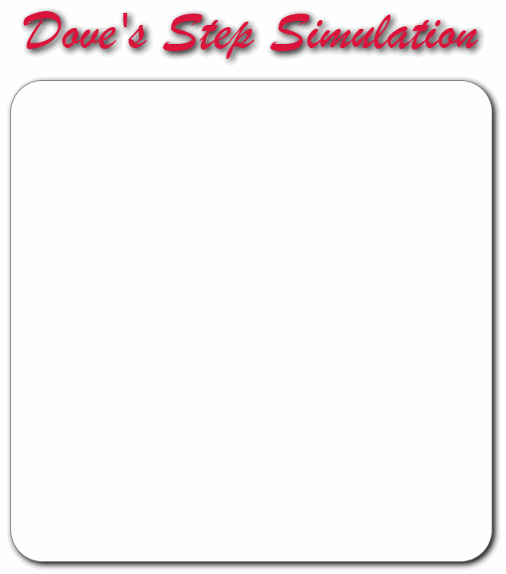
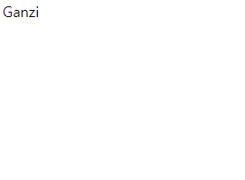

# [My JavaScript Practice](../README.md#my-web-practice)

This directory is for codes that consist of pure *HTML*, *CSS* and *JavaScript*


### List

- [Dove's Step 1 (2022.01.13)](#doves-step-1-20220113)
- [Script Tag's Location (2022.01.02)](#script-tags-location-20220102)
- [Colorful Show (2020.03.04)](#colorful-show-20200304)
- [Ganzi (2017.04.03)](#ganzi-20170403)


## [Dove's Step 1 (2022.01.13)](#list)

- Done
  - Generate random footprints on **HTML Canvas**
  - Draw the `canvas`' edges rounded with `border-radius` in **CSS**
  - Get position (x, y) on `canvas` that is located relatively
  - Draw footprints in detail with **trigonometric function**
- To-be
  - ~~Draw random footprints on **HTML Canvas**~~ (done)
  - Draw them more naturally with angle and speed
  - Make them disappear gradually like ont the natural snowfield
- Codes and Results  
  <!--    -->
  <details>
    <summary>DoveStep.html</summary>

  ```html
  <!doctype html>

  <html lang="en">

      <head>

          <meta charset="utf-8">

          <title>Dove Step Simulation</title>
          <meta name="author" content="kimpro82">

          <link rel="stylesheet" href="DoveStep.css">
          <script defer src="DoveStep.js"></script>

      </head>

      <body>

          <p id="title">Dove's Step Simulation</p>

          <canvas id="canvas" width=600 height=600></canvas>
          <!-- It is necessary to fill width and height in HTML for dealing it with js -->

      </body>

  </html>
  ```
  </details>
  <details>
    <summary>DoveStep.css</summary>

  ```css
  body
  {
      text-align: center;
      font-size: 10px;
  }
  ```
  ```css
  #title
  {
      margin-top: 8rem;
      font-size: 4.5rem;
      margin-bottom: 1rem;

      font-family: Brush Script MT, Georgia, Garamond, Times New Roman, serif;

      color: crimson;
      text-shadow: 0.2rem 0.2rem 0.5rem black;
  }
  ```
  ```css
  #canvas
  {
      width: 600px;
      height: 600px;

      background-color: white;

      border: 1px solid gray;
      border-radius: 40px;

      box-shadow: 0.2rem 0.2rem 0.5rem;
  }
  ```
  </details>
  <details>
    <summary>DoveStep.js</summary>

  ```js
  // Declare global variables
  const canvas = document.getElementById("canvas");
  const ctx = canvas.getContext("2d");
  var x = -1, y = -1, direction = 0, step = 0;
  var interval = 1000;
  ```
  ```js
  // Start with a click on the canvas
  canvas.onclick = function(event)
  {
      x = event.clientX - ctx.canvas.offsetLeft;
      y = event.clientY - ctx.canvas.offsetTop;
      // test
      console.log("click point :", x, y);

      footPrint();
  }
  ```
  ```js
  // Determine where the next step is located
  function randomWalk()
  {
      if (x >= 0)
      {
          if (step > 19)
          {
              alert("The dove has archieved " + step + " steps. It became a budda and flied away!");
              return -1;
          }
          else
          {
              x = Math.round(Math.random() * 560) + 20;
              y = Math.round(Math.random() * 560) + 20;
              direction = Math.floor(Math.random() * 360);    // 0 ~ 359

              footPrint();
          }
      }
  }
  ```
  ```js
  // Figure the foot print in detail
  function footPrint()
  {
      var angles = [45, 90, 135, 270];
      ctx.beginPath();
      for (let i = 0; i < 4; i++)
      {
          ctx.moveTo(x, y);
          var x2 = x - Math.round(Math.cos(Math.PI * (angles[i] + direction) / 180) * 20);
          var y2 = y - Math.round(Math.sin(Math.PI * (angles[i] + direction) / 180) * 20);
          ctx.lineTo(x2, y2);
      }
      ctx.closePath();
      ctx.stroke();

      step++;

      // test
      console.log(step + "th step :", x, y, direction);
  }
  ```
  ```js
  // Loop by setInterval()
  setInterval(randomWalk, interval);
  ```
  </details>
  <details>
    <summary>DoveStepTest.js</summary>

  ```js
  // Rounding off in JavaScript

  console.log(Math.floor(0.7))                // 0
  console.log(Math.ceil(1.3))                 // 2
  console.log(Math.round(2.3))                // 2
  console.log(Math.round(2.7))                // 3
  ```
  ```js
  // Trigonometric Function in JavaScript

  console.log(Math.PI);                       // 3.141592653589793
  console.log(Math.PI / 180)                  // 0.017453292519943295

  console.log(Math.sin(Math.PI / 180))        // 0.01745240643728351
  console.log(Math.cos(Math.PI / 180))        // 0.9998476951563913

  console.log(Math.sin(Math.PI *   0 / 180))  // 0
  console.log(Math.sin(Math.PI *  30 / 180))  // 0.49999999999999994
  console.log(Math.sin(Math.PI *  45 / 180))  // 0.7071067811865475
  console.log(Math.sin(Math.PI *  60 / 180))  // 0.8660254037844386
  console.log(Math.sin(Math.PI *  90 / 180))  // 1
  console.log(Math.sin(Math.PI * 180 / 180))  // 1.2246467991473532e-16 ≒ 0
  console.log(Math.sin(Math.PI * 270 / 180))  // -1
  console.log(Math.sin(Math.PI * 360 / 180))  // -2.4492935982947064e-16 ≒ 0

  console.log(Math.cos(Math.PI *   0 / 180))  // 1
  console.log(Math.cos(Math.PI *  30 / 180))  // 0.8660254037844387
  console.log(Math.cos(Math.PI *  45 / 180))  // 0.7071067811865476
  console.log(Math.cos(Math.PI *  60 / 180))  // 0.5000000000000001
  console.log(Math.cos(Math.PI *  90 / 180))  // 6.123233995736766e-17 ≒ 0
  console.log(Math.cos(Math.PI * 180 / 180))  // -1
  console.log(Math.cos(Math.PI * 270 / 180))  // -1.8369701987210297e-16 ≒ 0
  console.log(Math.cos(Math.PI * 360 / 180))  // 1
  ```
  </details>


## [Script Tag's Location (2022.01.02)](#list)

- A topic suggested from my friend [*Alibaba*](https://github.com/abiriadev)
- Compare the results from where the `script` tag is located
- Arrange `script` tag into the `head` with external `.js` file link and don't forget the option **`defer`**

### Codes and Results
- Case 1. Script tag in the Head
  
  <details>
    <summary>ScriptInHTML_Head.html</summary>

  ```html
  ……
      <head>

          <meta charset="EUC-KR">
          <title>Script in the Head</title>
          <link rel="stylesheet" href="ScriptInHTML.css">
          <script>document.getElementsByTagName('p')[0].style.color = "red"</script>

      </head>
  ……
  ```
  </details>
  <details>
    <summary>ScriptInHTML_Head.css</summary>

  ```css
  p {
    text-align: center;
    font-family: Brush Script MT, Georgia, Garamond, Times New Roman, serif;
    /* font reference ☞ https://www.w3schools.com/css/css_font.asp */
      color: blue;
    font-size: 700%;
    margin: 0;
  }
  ```
  </details>

- Case 2. Script tag in the Bottom of the Body
  
  <details>
    <summary>ScriptInHTML_BodyEnd.html</summary>

  ```html
  ……
      <body>

          <p>Be the reads!</p>
          <script>document.getElementsByTagName('p')[0].style.color = "red"</script>

      </body>
  ……
  ```
  </details>

- Case 3. Script tag with `defer` option
  
  <details>
    <summary>ScriptWithDefer.html</summary>

  ```html
  ……
      <head>

          ……
          <script defer src="ScriptInExternalJS.js"></script>
          <!-- don't forget "defer" ! -->

      </head>
  ……
  ```
  </details>
  <details>
    <summary>ScriptWithDefer.js</summary>

  ```js
  document.getElementsByTagName('p')[0].style.color = "red"
  ```
  </details>


## [Colorful Show (2020.03.04)](#list)

- This is a colorful 'Show'

  

  <details>
    <summary>ColorfulShow.html</summary>

  ```html
  <!DOCTYPE html>

  <html>

  <head>
    <meta charset="EUC-KR">
    <title>Colorful Show</title>
      <link rel="stylesheet" href="ColorfulShow.css">
  </head>

  <body>
    <p id='chameleon'>Show</p>
      <script src="ColorfulShow.js">
      <!--
        <script> can be located in <head> or <body>. 
        But, in this case, we should consider execution sequence.
      -->
      
    </script> 
  </body>

  </html>
  ```
  </details>
  <details>
    <summary>ColorfulShow.css</summary>

  ```css
  @charset "EUC-KR";

  #chameleon {
    text-align: center;
    font-family: "Times New Roman", Times, serif;
    font-size: 1000%;
  }
  ```
  </details>
  <details>
    <summary>ColorfulShow.js</summary>

  ```javascript
  function changeColor() {
    randNumDec = Math.floor(Math.random() * Math.pow(256, 3));
      /*
      * Math.random() returns a number lower than 1.
      * Math.floor() returns the largest integer less than or equal to a given number.
      * 256**3 is for the RGB color range between #000000 ~ #FFFFFF.
      */
    randNumHex = randNumDec.toString(16); /* Convert Decimal to Hexadecimal */

    /* document.write(randNumHex, "<br>"); */
      /* document.write() returns real HTML codes. */
      /* document.write(typeof randColor);
      * string
      */

    document.getElementById('chameleon').style.color = '#' + randNumHex;
  }

  setInterval(changeColor, 1000);
  ```
  </details>


## [Ganzi (2017.04.03)](#list)

- A simple Javascript practice

  

  <details>
    <summary>Ganzi.html</summary>

  ```html
  <div id ="Zure">Ganzi</div>

  <script type="text/javascript">
    
  function thunder() {
    var x = document.getElementById("Zure");
    var storm = document.write(x.innerHTML + " Storm");
    Zure.replace(x,storm);
  }
  setInterval(thunder, 3000);
    
  </script>
  ```
  </details>