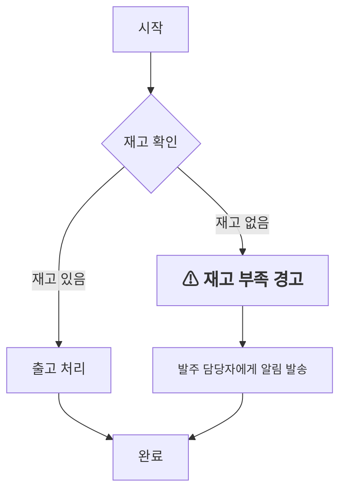
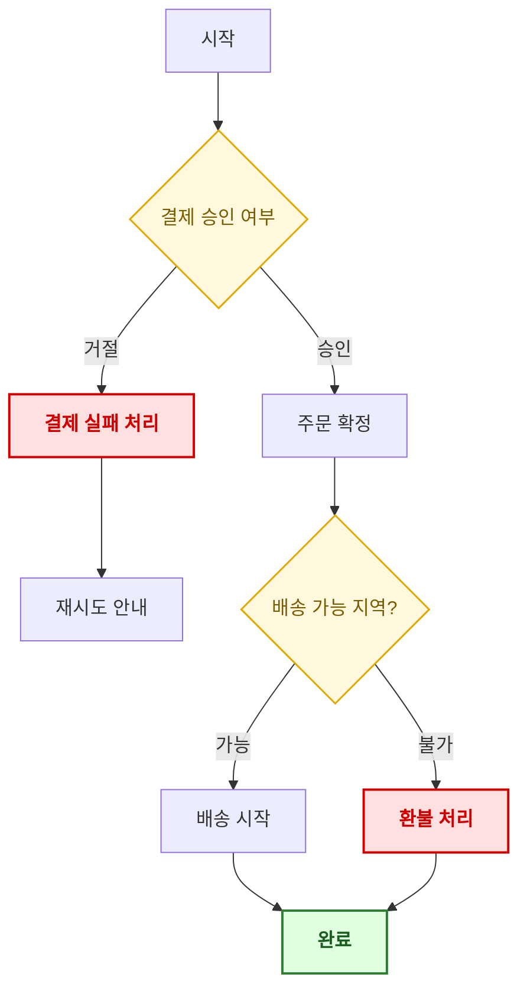

# Topic 1. 노드 텍스트 크기/색상 커스터마이징

## 목표
중요한 의사결정 노드나 예외 처리 노드의 폰트 크기, 색상, 굵기를 조절하여 가독성을 확보한다.

## 연습 내용
1. 노드 텍스트 안에 인라인 HTML 태그(``)를 사용해 개별 스타일 적용
2. `classDef` 로 재사용 가능한 공통 스타일을 정의하고 `class` 로 적용

---

## 1) 인라인 `` 스타일 적용

- 노드 `D`, `E`는 개별 노드에만 적용되는 인라인 스타일 예시이다.
- 폰트 크기(`font-size`), 색상(`color`), 굵기(`font-weight`)를 노드마다 다르게 지정할 수 있다.
- 단점: 노드가 많아질수록 스타일 코드가 중복되어 유지보수가 어려워진다. → `classDef` 로 해결.

---

## 2) `classDef` 로 재사용 스타일 정의

- `classDef` 는 색상(`fill`, `stroke`, `color`), 굵기(`font-weight`), 테두리 두께(`stroke-width`) 등을 한 번에 정의한다.
- `class 노드ID,노드ID class명` 구문으로 여러 노드에 동일 스타일을 일괄 적용할 수 있어 유지보수가 쉽다.

## 정리
| 방식 | 장점 | 단점 |
|---|---|---|
| 인라인 `` | 노드 하나만 예외적으로 강조할 때 빠름 | 반복되면 코드가 지저분해짐 |
| `classDef` + `class` | 일관된 스타일을 재사용, 유지보수 용이 | 노드별 미세 조정에는 부적합 |

→ **원칙**: 전역/그룹 스타일은 `classDef`, 특정 노드 1회성 강조는 인라인 스타일을 혼용하는 것이 실무적으로 효율적이다.
