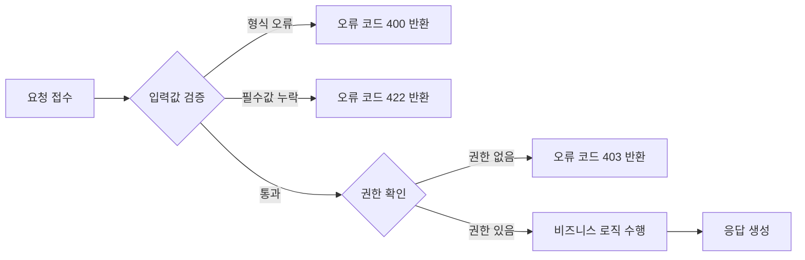
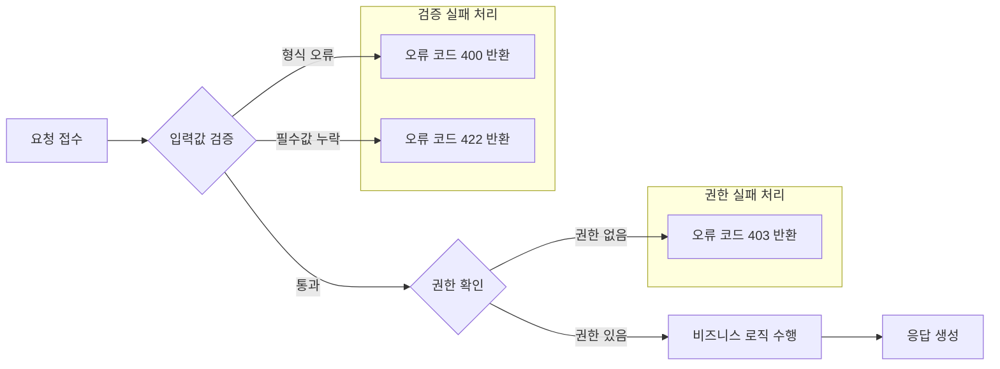

# Topic 2. 하이브리드 가로/세로 플로우차트로 공간 최적화

## 목표
전체 흐름은 가로(`LR`)로 유지하면서, 조건 분기가 복잡한 구간만 `subgraph` 내부에서 `direction TB` 를 지정해 세로로 전개함으로써 화면 낭비를 줄인다.

## 연습 내용
- `subgraph` 별 `direction TB` / `direction LR` 선언을 조합한 하이브리드 레이아웃 구성

---

## 1) 전체를 `LR`로만 그렸을 때 (비교용, 가로로 계속 늘어남)

- 조건 분기(`B`, `E`)에서 나오는 오류 노드들이 모두 가로로 나열되어 화면 폭이 지나치게 넓어진다.

---

## 2) 하이브리드 레이아웃: 전체 `LR` + 분기 구간만 내부 `TB`

- 전체 흐름(`A → B → E → G → H`)은 그대로 `LR`을 유지해 한눈에 프로세스 순서를 파악할 수 있다.
- 오류 처리처럼 지엽적인 분기는 `subgraph` 안에서 `direction TB` 로 세로 배치하여 가로 폭 낭비를 줄인다.
- 상위 플로우차트의 기본 `direction`(`LR`)과 무관하게 각 `subgraph` 내부에서 독립적으로 `direction` 을 지정할 수 있다.

## 정리
- `flowchart` 전체 방향과 `subgraph` 내부 방향은 서로 다르게 지정 가능하다.
- 분기가 많은 영역(에러 처리, 예외 케이스 등)을 별도 `subgraph`로 묶고 `direction TB`를 주면, 전체 폭은 좁게 유지하면서 세부 내용은 세로로 확장할 수 있다.
- 문서/다이어그램이 가로로 너무 길어질 때 우선적으로 적용해볼 수 있는 레이아웃 최적화 기법이다.
