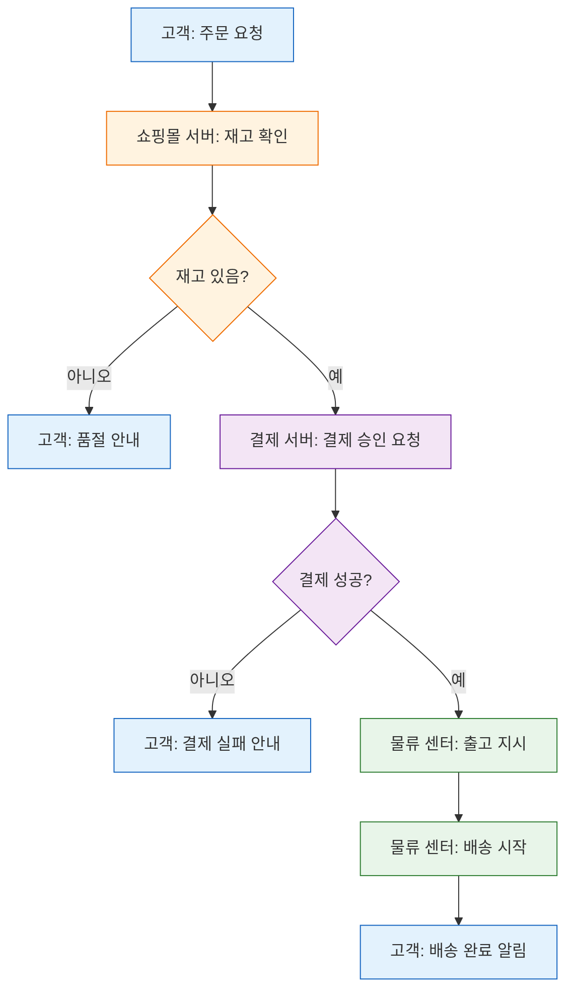
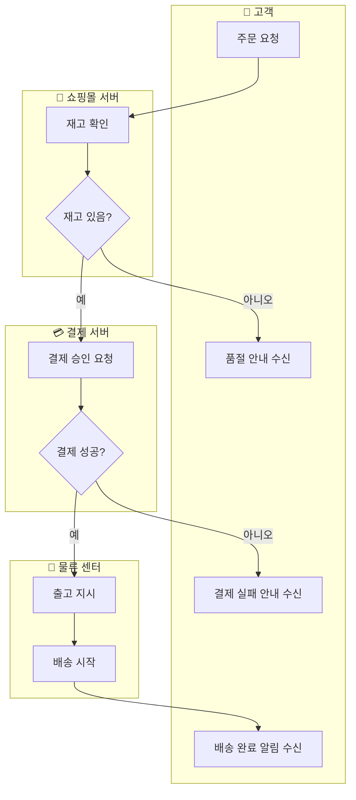

# Topic 3. 스윔레인 vs 전통적 플로우차트 구조 비교

## 목표
시스템별 책임 영역을 명확히 구분하는 스윔레인(Swimlane) 구조와, 일반적인 단일 플로우차트(+ `subgraph`) 구조의 가독성 및 레이아웃 안정성을 비교하여 상황별 적합한 선택 기준을 세운다.

## 연습 내용
- 동일한 프로세스("온라인 주문 처리")를 두 가지 방식으로 표현하고 비교

---

## 1) 단일 플로우차트 + `subgraph` (전통적 방식)

- 담당 시스템(고객/쇼핑몰/결제/물류)을 노드 텍스트와 `classDef` 색상으로만 구분한다.
- 노드 수가 늘어나면 "어느 시스템이 어떤 단계를 담당하는지"를 색상 범례에 의존해서 파악해야 하므로, 프로세스가 길어질수록 추적이 번거로워진다.

---

## 2) 스윔레인 구조 (시스템별 `subgraph` 분리)

- 각 `subgraph`가 하나의 "레인(lane)"이 되어, 어떤 시스템이 어떤 노드를 담당하는지 위치 자체로 즉시 드러난다.
- 시스템 간 경계를 넘나드는 화살표(`C -->|예| E`, `F -->|예| H` 등)가 곧 "시스템 간 인터페이스/책임 이관 지점"을 의미하게 되어, 통합 지점 파악이 쉽다.

---

## 3) 비교 결과

| 항목 | 단일 플로우차트 + `subgraph`(색상 구분) | 스윔레인 구조 |
|---|---|---|
| 담당 주체 파악 | 범례(색상)를 따로 확인해야 함 | 레인 위치만으로 즉시 파악 |
| 시스템 간 경계(인터페이스) 식별 | 명시적이지 않음 | 레인을 가로지르는 화살표로 명확히 드러남 |
| 노드 수 증가 시 안정성 | 노드가 늘어도 레이아웃 자체는 단순 | 레인별 노드 수 불균형 시 레인 폭/높이가 불균등해질 수 있음 |
| 작성 난이도 | 낮음 (`classDef` 몇 개만 정의) | 다소 높음 (`subgraph`별 방향/그룹 관리 필요) |
| 적합한 상황 | 단일 시스템 내부 로직, 담당 주체 구분이 덜 중요한 경우 | 여러 팀/시스템이 협업하는 프로세스, 책임 소재·핸드오프 지점이 중요한 경우 |

## 선택 기준 정리
1. **프로세스가 하나의 시스템/팀 내부에서 완결**되면 → 단일 플로우차트(+ `classDef` 강조)로 충분하다.
2. **여러 시스템·팀이 순차적으로 관여하고 책임 이관 지점(핸드오프)을 명확히 보여줘야** 하면 → 스윔레인 구조가 적합하다.
3. 다만 스윔레인은 각 레인의 노드 수 차이가 크면 레이아웃이 불안정(레인 폭 불균형, 화살표 교차)해질 수 있으므로, 레인별 노드 수를 가능한 균형 있게 설계하는 것이 좋다.
