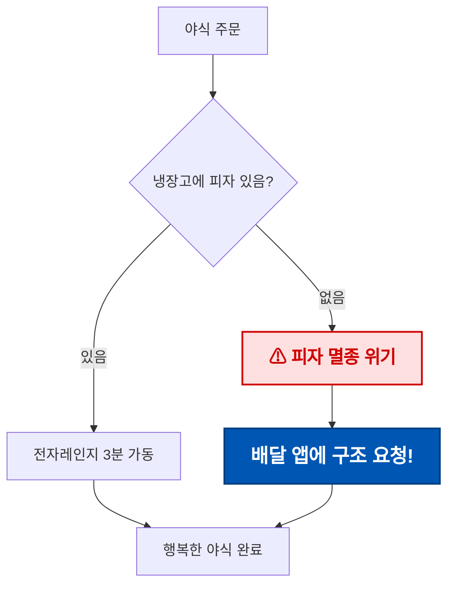
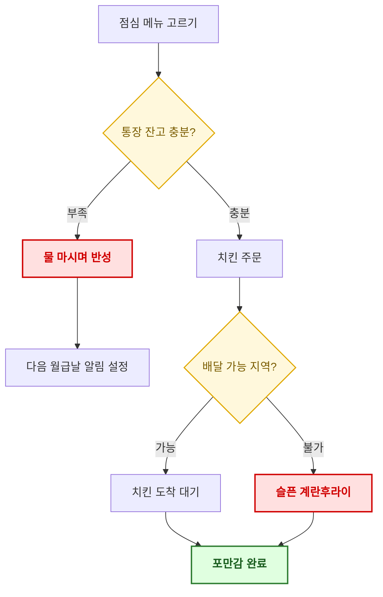
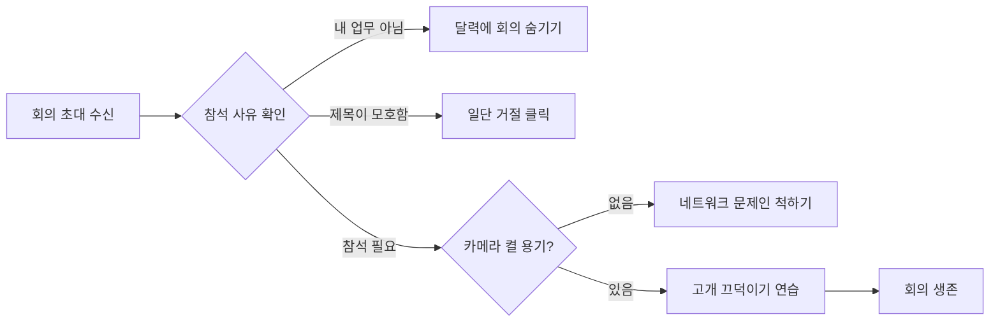
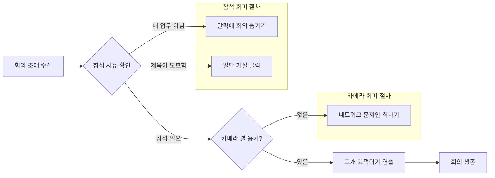
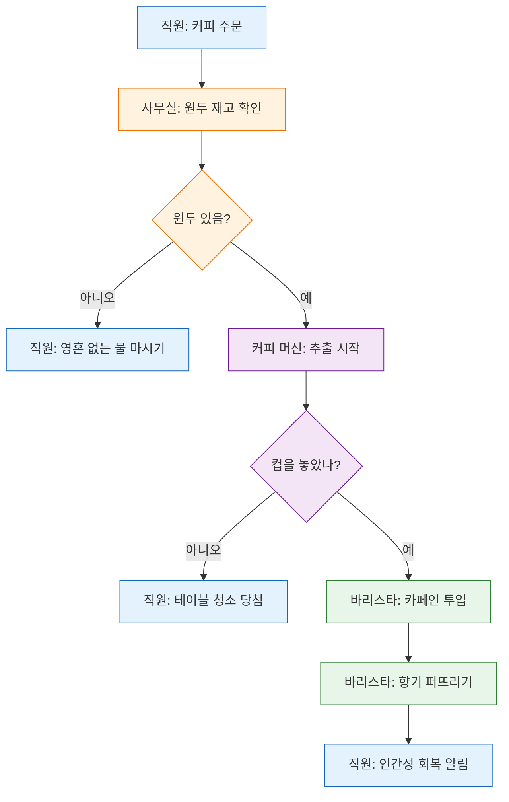
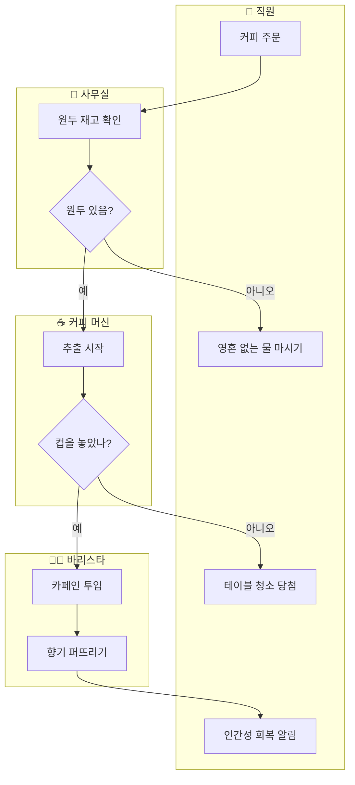

# [My Mermaid Practice](../README.md#mermaid)

Practice codes focused on *Mermaid* `flowchart` syntax, mainly node styling, layout optimization and swimlane structures.

Each mermaid diagram below is also saved as an independent `.mmd` file under [`/diagrams`](/Mermaid/diagrams/), so it can be reused or rendered by external tools directly.

### \<List>

- [Advanced Flowchart Practice](#advanced-flowchart-practice)
- [Topic 1: Node Text Styling](#topic-1-노드-텍스트-크기색상-커스터마이징)
- [Topic 2: Hybrid Horizontal/Vertical Layout](#topic-2-하이브리드-가로세로-플로우차트로-공간-최적화)
- [Topic 3: Swimlane vs Traditional Flowchart](#topic-3-스윔레인-vs-전통적-플로우차트-구조-비교)

---

## Advanced Flowchart Practice

Core `flowchart` practice covering node styling, hybrid layout control, and responsibility-oriented diagram structures.

### Topic 1. 노드 텍스트 크기/색상 커스터마이징

#### 목표
중요한 의사결정 노드나 예외 처리 노드의 폰트 크기, 색상, 굵기를 조절하여 가독성을 확보한다.

#### 연습 내용
1. 노드 텍스트 안에 인라인 HTML 태그(``)를 사용해 개별 스타일 적용
2. `classDef` 로 재사용 가능한 공통 스타일을 정의하고 `class` 로 적용

##### 1) 인라인 `` 스타일 적용
([`diagrams/01a_InlineSpanStyle.mmd`](/Mermaid/diagrams/01a_InlineSpanStyle.mmd))

- 노드 `D`, `E`의 텍스트 크기와 굵기는 개별 인라인 스타일로 적용한다.
- 노드 색상은 `classDef`의 `fill`, `stroke`, `color`로 적용한다. `rescue`는 파란 배경과 흰 글씨로 명확한 대비를 만든다.
- 인라인 HTML의 `color`는 Mermaid 보안 설정이나 렌더러에 따라 무시될 수 있으므로, 노드 색상에는 `classDef`를 사용한다.

##### 2) `classDef` 로 재사용 스타일 정의
([`diagrams/01b_ClassDefStyle.mmd`](/Mermaid/diagrams/01b_ClassDefStyle.mmd))

- `classDef` 는 색상(`fill`, `stroke`, `color`), 굵기(`font-weight`), 테두리 두께(`stroke-width`) 등을 한 번에 정의한다.
- `class 노드ID,노드ID class명` 구문으로 여러 노드에 동일 스타일을 일괄 적용할 수 있어 유지보수가 쉽다.

#### 정리
| 방식 | 장점 | 단점 |
|---|---|---|
| 인라인 `` | 노드 하나만 예외적으로 강조할 때 빠름 | 반복되면 코드가 지저분해짐 |
| `classDef` + `class` | 일관된 스타일을 재사용, 유지보수 용이 | 노드별 미세 조정에는 부적합 |

→ **원칙**: 전역/그룹 스타일은 `classDef`, 특정 노드 1회성 강조는 인라인 스타일을 혼용하는 것이 실무적으로 효율적이다.

---

### Topic 2. 하이브리드 가로/세로 플로우차트로 공간 최적화

#### 목표
전체 흐름은 가로(`LR`)로 유지하면서, 조건 분기가 복잡한 구간만 `subgraph` 내부에서 `direction TB` 를 지정해 세로로 전개함으로써 화면 낭비를 줄인다.

#### 연습 내용
- `subgraph` 별 `direction TB` / `direction LR` 선언을 조합한 하이브리드 레이아웃 구성

##### 1) 전체를 `LR`로만 그렸을 때 (비교용, 가로로 계속 늘어남)
([`diagrams/02a_FullLR.mmd`](/Mermaid/diagrams/02a_FullLR.mmd))

- 조건 분기(`B`, `E`)에서 나오는 회피 노드들이 모두 가로로 나열되어 화면 폭이 지나치게 넓어진다.

##### 2) 하이브리드 레이아웃: 전체 `LR` + 분기 구간만 내부 `TB`
([`diagrams/02b_HybridLR_TB.mmd`](/Mermaid/diagrams/02b_HybridLR_TB.mmd))

- 전체 흐름(`A → B → E → G → H`)은 그대로 `LR`을 유지해 한눈에 진행 순서를 파악할 수 있다.
- 회피 절차처럼 지엽적인 분기는 `subgraph` 안에서 `direction TB` 로 세로 배치하여 가로 폭 낭비를 줄인다.
- 상위 플로우차트의 기본 `direction`(`LR`)과 무관하게 각 `subgraph` 내부에서 독립적으로 `direction` 을 지정할 수 있다.

#### 정리
- `flowchart` 전체 방향과 `subgraph` 내부 방향은 서로 다르게 지정 가능하다.
- 분기가 많은 영역(에러 처리, 예외 케이스 등)을 별도 `subgraph`로 묶고 `direction TB`를 주면, 전체 폭은 좁게 유지하면서 세부 내용은 세로로 확장할 수 있다.
- 문서/다이어그램이 가로로 너무 길어질 때 우선적으로 적용해볼 수 있는 레이아웃 최적화 기법이다.

---

### Topic 3. 스윔레인 vs 전통적 플로우차트 구조 비교

#### 목표
시스템별 책임 영역을 명확히 구분하는 스윔레인(Swimlane) 구조와, 일반적인 단일 플로우차트(+ `subgraph`) 구조의 가독성 및 레이아웃 안정성을 비교하여 상황별 적합한 선택 기준을 세운다.

#### 연습 내용
- 동일한 프로세스("온라인 주문 처리")를 두 가지 방식으로 표현하고 비교

##### 1) 단일 플로우차트 + `subgraph` (전통적 방식)
([`diagrams/03a_SingleFlowchartSubgraph.mmd`](/Mermaid/diagrams/03a_SingleFlowchartSubgraph.mmd))

- 담당 주체(직원/사무실/커피 머신/바리스타)를 노드 텍스트와 `classDef` 색상으로만 구분한다.
- 노드 수가 늘어나면 "어느 시스템이 어떤 단계를 담당하는지"를 색상 범례에 의존해서 파악해야 하므로, 프로세스가 길어질수록 추적이 번거로워진다.

##### 2) 스윔레인 구조 (시스템별 `subgraph` 분리)
([`diagrams/03b_SwimlaneStructure.mmd`](/Mermaid/diagrams/03b_SwimlaneStructure.mmd))

- 각 `subgraph`가 하나의 "레인(lane)"이 되어, 어떤 시스템이 어떤 노드를 담당하는지 위치 자체로 즉시 드러난다.
- 시스템 간 경계를 넘나드는 화살표(`C -->|예| E`, `F -->|예| H` 등)가 곧 "시스템 간 인터페이스/책임 이관 지점"을 의미하게 되어, 통합 지점 파악이 쉽다.

##### 3) 비교 결과

| 항목 | 단일 플로우차트 + `subgraph`(색상 구분) | 스윔레인 구조 |
|---|---|---|
| 담당 주체 파악 | 범례(색상)를 따로 확인해야 함 | 레인 위치만으로 즉시 파악 |
| 시스템 간 경계(인터페이스) 식별 | 명시적이지 않음 | 레인을 가로지르는 화살표로 명확히 드러남 |
| 노드 수 증가 시 안정성 | 노드가 늘어도 레이아웃 자체는 단순 | 레인별 노드 수 불균형 시 레인 폭/높이가 불균등해질 수 있음 |
| 작성 난이도 | 낮음 (`classDef` 몇 개만 정의) | 다소 높음 (`subgraph`별 방향/그룹 관리 필요) |
| 적합한 상황 | 단일 시스템 내부 로직, 담당 주체 구분이 덜 중요한 경우 | 여러 팀/시스템이 협업하는 프로세스, 책임 소재·핸드오프 지점이 중요한 경우 |

#### 선택 기준 정리
1. **프로세스가 하나의 시스템/팀 내부에서 완결**되면 → 단일 플로우차트(+ `classDef` 강조)로 충분하다.
2. **여러 시스템·팀이 순차적으로 관여하고 책임 이관 지점(핸드오프)을 명확히 보여줘야** 하면 → 스윔레인 구조가 적합하다.
3. 다만 스윔레인은 각 레인의 노드 수 차이가 크면 레이아웃이 불안정(레인 폭 불균형, 화살표 교차)해질 수 있으므로, 레인별 노드 수를 가능한 균형 있게 설계하는 것이 좋다.
