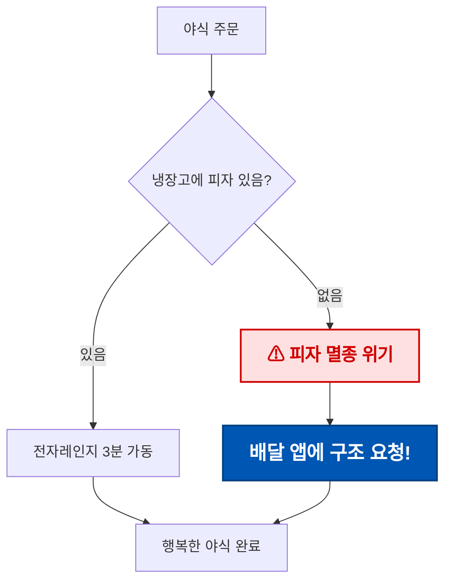
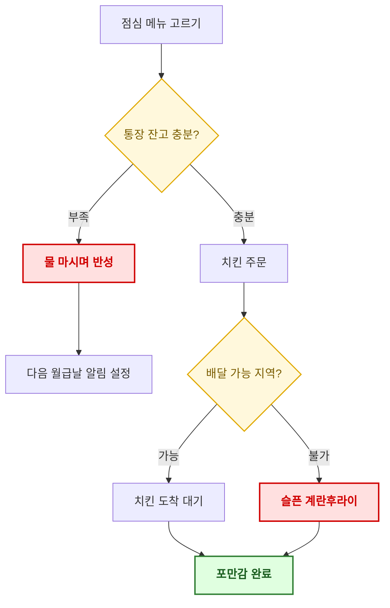
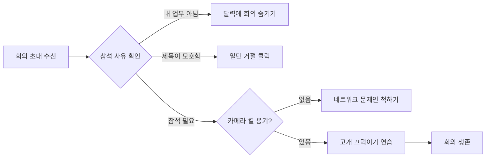
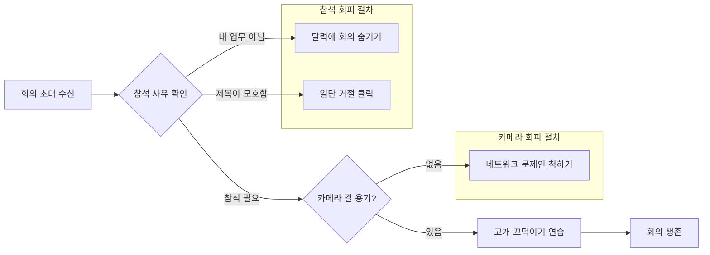
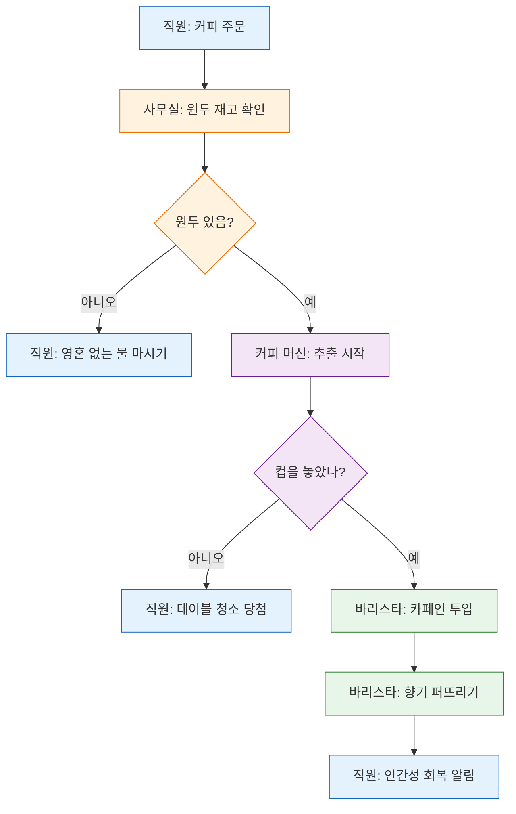
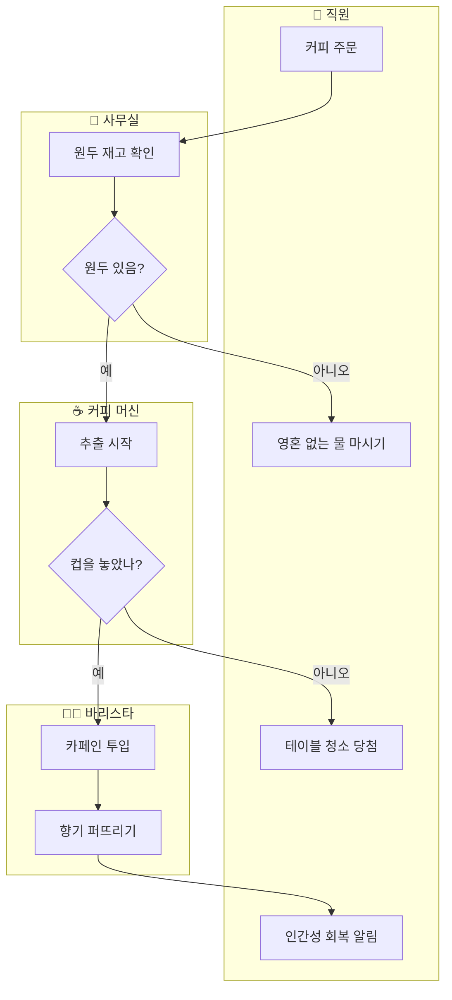

# [My Mermaid Practice](../README.md#mermaid)

Practice codes focused on *Mermaid* `flowchart` syntax, mainly node styling, layout optimization and swimlane structures.

Each mermaid diagram below is also saved as an independent `.mmd` file under [`/diagrams`](/Mermaid/diagrams/), so it can be reused or rendered by external tools directly.

### \<List>

- [Advanced Flowchart Practice (2026.08.31)](#advanced-flowchart-practice-20260831)

---

## Advanced Flowchart Practice (2026.08.31)

Core `flowchart` practice covering node styling, hybrid layout control, and responsibility-oriented diagram structures.

### Topic 1. Node Text Size and Color Customization

#### Goal
Improve readability by controlling font size, color, and weight for important decision and exception-handling nodes.

#### Practice Content
1. Apply one-off styles with inline HTML (``) inside node text.
2. Define reusable shared styles with `classDef` and apply them through `class`.

##### 1) Inline `` Styling
([`diagrams/01a_InlineSpanStyle.mmd`](/Mermaid/diagrams/01a_InlineSpanStyle.mmd))

- Nodes `D` and `E` use inline styling for their individual text size and weight.
- Node colors use `fill`, `stroke`, and `color` from `classDef`. The `rescue` class uses a blue background with white text for strong contrast.
- Inline HTML `color` may be ignored depending on Mermaid security settings or the renderer, so use `classDef` for node colors.

##### 2) Reusable Styles with `classDef`
([`diagrams/01b_ClassDefStyle.mmd`](/Mermaid/diagrams/01b_ClassDefStyle.mmd))

- `classDef` defines colors (`fill`, `stroke`, `color`), weight (`font-weight`), border width (`stroke-width`), and more in one place.
- The `class nodeId,nodeId className` syntax applies the same style to multiple nodes, which makes maintenance easier.

#### Summary
| Approach | Strength | Limitation |
|---|---|---|
| Inline `` | Quick for an exceptional emphasis on one node | Repetition makes the code cluttered |
| `classDef` + `class` | Reuses consistent styles and is easy to maintain | Less suited to per-node fine tuning |

**Guideline:** Use `classDef` for shared or group styles and inline styling for one-off emphasis on individual nodes.

---

### Topic 2. Space Optimization with Hybrid Horizontal and Vertical Flowcharts

#### Goal
Reduce wasted space by keeping the overall flow horizontal (`LR`) and arranging only complex conditional branches vertically with `direction TB` inside a `subgraph`.

#### Practice Content
- Build hybrid layouts by combining `direction TB` and `direction LR` declarations for individual `subgraph` sections.

##### 1) Entire Diagram in `LR` (Comparison: It Continues to Expand Horizontally)
([`diagrams/02a_FullLR.mmd`](/Mermaid/diagrams/02a_FullLR.mmd))

- The avoidance nodes branching from conditions `B` and `E` all appear horizontally, making the diagram unnecessarily wide.

##### 2) Hybrid Layout: Overall `LR` with Branches in `TB`
([`diagrams/02b_HybridLR_TB.mmd`](/Mermaid/diagrams/02b_HybridLR_TB.mmd))

- The main flow (`A → B → E → G → H`) remains `LR`, so the process order is easy to scan.
- Local branches, such as avoidance procedures, are arranged vertically with `direction TB` inside a `subgraph` to reduce horizontal sprawl.
- Each `subgraph` can declare its own `direction` independently of the parent flowchart direction (`LR`).

#### Summary
- The overall `flowchart` direction and a `subgraph` direction can be different.
- Group branch-heavy areas, such as error handling and exceptions, in a separate `subgraph` with `direction TB` to keep the diagram narrow while expanding details vertically.
- This is a useful layout optimization when a document or diagram becomes too wide.

---

### Topic 3. Structural Comparison: Swimlanes vs Traditional Flowcharts

#### Goal
Compare the readability and layout stability of swimlanes, which clearly separate ownership by system, with a standard single flowchart using `subgraph`, and establish selection criteria for each context.

#### Practice Content
- Model the same process in two forms and compare them.

<table>
  <tr>
    <td width="50%" valign="top">
      <strong>1) Single Flowchart with <code>subgraph</code> (Traditional Approach)</strong> 
      (<a href="/Mermaid/diagrams/03a_SingleFlowchartSubgraph.mmd"><code>diagrams/03a_SingleFlowchartSubgraph.mmd</code></a>)

The responsible party is distinguished only through node text and <code>classDef</code> colors. As the number of nodes grows, readers must rely on the color legend to identify responsibility, making longer processes harder to trace.
    </td>
    <td width="50%" valign="top">
      <strong>2) Swimlane Structure (One <code>subgraph</code> per System)</strong> 
      (<a href="/Mermaid/diagrams/03b_SwimlaneStructure.mmd"><code>diagrams/03b_SwimlaneStructure.mmd</code></a>)

Each <code>subgraph</code> becomes a lane, making node ownership immediately visible through position. Arrows crossing system boundaries show system interfaces and responsibility handoff points, making integrations easier to identify.
    </td>
  </tr>
</table>

##### 3) Comparison

| Criterion | Single Flowchart + `subgraph` (Color Grouping) | Swimlane Structure |
|---|---|---|
| Identifying ownership | Requires checking a separate color legend | Immediately visible from lane position |
| Identifying system boundaries and interfaces | Not explicit | Clear from arrows crossing lanes |
| Stability as node count grows | The layout remains simple | Uneven node counts can create uneven lane dimensions |
| Authoring effort | Low: only a few `classDef` declarations | Higher: each `subgraph` needs direction and group management |
| Best fit | Internal logic in one system where ownership is less important | Multi-team or multi-system processes where ownership and handoffs matter |

#### Selection Guidelines
1. When a process is contained within one system or team, a single flowchart with `classDef` emphasis is sufficient.
2. When several systems or teams participate sequentially and responsibility handoffs must be clear, use a swimlane structure.
3. Swimlane layouts can become unstable when lane node counts differ greatly, causing uneven dimensions and arrow crossings. Keep lane content as balanced as practical.
