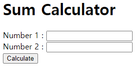

# [My Python Web Practice](../README.md)

Django, Flask and FastAPI


### \<List>

- [Flask/FastAPI : Sum Calculator (2024.06.07)](#flaskfastapi--sum-calculator-20240607)


## [Flask/FastAPI : Sum Calculator (2024.06.07)](#list)

- Initial Practice of *Flask* and *FastAPI*

  

  - Flask is simple but FastAPI supports asynchronous programming.
  - The results are absolutely the same.

- How to Run
  - Flask
    - Installation : `pip install Flask`
    - Run : `flask run` or `python app.py`
  - FastAPI
    - Installation : `pip install fastapi uvicorn jinja2`
    - Run : `fastapi run` or `python main.py`

- Code
  <details>
    <summary>Flask : app.py</summary>

  ```python
  from flask import Flask, request, render_template
  ```
  ```python
  app = Flask(__name__)

  @app.route('/', methods=['GET', 'POST'])
  def index():
      """
      Handle the root URL route and calculate the sum of two numbers.

      Returns:
          str: Rendered HTML template with the result if POST request, otherwise the form.
      """
      result = None
      if request.method == 'POST':
          try:
              num1 = float(request.form['num1'])
              num2 = float(request.form['num2'])
              result = num1 + num2
          except (ValueError, KeyError):
              result = 'Invalid input. Please enter valid numbers.'
      return render_template('index.html', result=result)
  ```
  ```python
  if __name__ == '__main__':
      # Run the Flask development server with debug mode enabled.
      app.run(debug=True)
  ```
  </details>
  <details>
    <summary>Flask : templates/index.html</summary>

  ```html
  <!doctype html>
  <html lang="en">
  <head>
      <meta charset="UTF-8">
      <meta name="viewport" content="width=device-width, initial-scale=1.0">
      <title>Sum Calculator (2024.06.07)</title>
  </head>
  <body>
      <h1>Sum Calculator</h1>
      <form method="post" action="/">
          <label for="num1">Number 1 :</label>
          <input type="text" id="num1" name="num1" required>
          <br>
          <label for="num2">Number 2 :</label>
          <input type="text" id="num2" name="num2" required>
          <br>
          <input type="submit" value="Calculate">
      </form>
      
          <h2>Result: {{ result }}</h2>
      
  </body>
  </html>
  ```
  </details>
  <details>
    <summary>FastAPI : main.py</summary>

  ```python
  from fastapi import FastAPI, Form
  from fastapi.responses import HTMLResponse
  from fastapi.templating import Jinja2Templates
  from fastapi.requests import Request
  ```
  ```python
  app = FastAPI()

  templates = Jinja2Templates(directory="templates")
  ```
  ```python
  @app.get("/", response_class=HTMLResponse)
  async def get_form(request: Request):
      """
      Handle the root URL route with a GET request.

      Args:
          request (Request): The request object.

      Returns:
          HTMLResponse: Rendered HTML form template.
      """
      return templates.TemplateResponse("index.html", {"request": request, "result": None})
  ```
  ```python
  @app.post("/", response_class=HTMLResponse)
  async def post_form(request: Request, num1: float = Form(...), num2: float = Form(...)):
      """
      Handle the root URL route with a POST request and calculate the sum of two numbers.

      Args:
          request (Request): The request object.
          num1 (float): The first number.
          num2 (float): The second number.

      Returns:
          HTMLResponse: Rendered HTML template with the result.
      """
      result = num1 + num2
      return templates.TemplateResponse("index.html", {"request": request, "result": result})
  ```
  ```python
  if __name__ == '__main__':
      import uvicorn
      # Run the FastAPI development server.
      uvicorn.run(app, host="127.0.0.1", port=8000, log_level="info")
  ```
  </details>
  <details>
    <summary>FastAPI : templates/index.html</summary>

  ```html
  <!doctype html>
  <html lang="en">
  <head>
      <meta charset="UTF-8">
      <meta name="viewport" content="width=device-width, initial-scale=1.0">
      <title>Sum Calculator (2024.06.07)</title>
  </head>
  <body>
      <h1>Sum Calculator</h1>
      <form method="post" action="/">
          <label for="num1">Number 1 :</label>
          <input type="text" id="num1" name="num1" required>
          <br>
          <label for="num2">Number 2 :</label>
          <input type="text" id="num2" name="num2" required>
          <br>
          <input type="submit" value="Calculate">
      </form>
      
          <h2>Result: {{ result }}</h2>
      
  </body>
  </html>
  ```
  </details>
