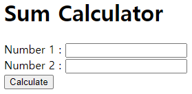

# [My Python Web Practice](../README.md)

Django, Flask, FastAPI and aiogram

### \<List>

- [*aiogram* : Telegram Bot Initial Practice (2026.03.31)](#aiogram--telegram-bot-initial-practice-20260331)
- [Flask/FastAPI : Sum Calculator (2024.06.07)](#flaskfastapi--sum-calculator-20240607)

## [*aiogram* : Telegram Bot Initial Practice (2026.03.31)](#list)

- Initial Practice for Telegram bot using *aiogram* library
  - Features include periodic time reports, `/time` command, `/pick` command, and echo handler.

  

- Development Environment  
  - *Python* 3.8.17 / *aiogram* 3.5.0 / *python-dotenv* 1.0.0 in local environment.

- How to Run
  - Installation : `pip install -r requirements.txt`
  - Set environment variables in `.env` file: `BOT_TOKEN` and `USER_ID`
  - Run : `python ./main.py`

## [*Flask*/*FastAPI* : Sum Calculator (2024.06.07)](#list)

- Initial Practice of *Flask* and *FastAPI*  
  - *Flask* is simple but *FastAPI* supports asynchronous programming.
  - The results are absolutely the same.

  

- Development Environment  
  - *Python* 3.8.17 / *Flask* 3.0.3 / *fastapi* 0.111.0 / *Jinja2* 3.1.4 in [*Replit*](https://replit.com/)

- How to Run
  - Flask
    - Installation : `pip install Flask`
    - Run : `flask run` or `python app.py`
  - FastAPI
    - Installation : `pip install fastapi uvicorn jinja2`
    - Run : `fastapi run` or `python main.py`
