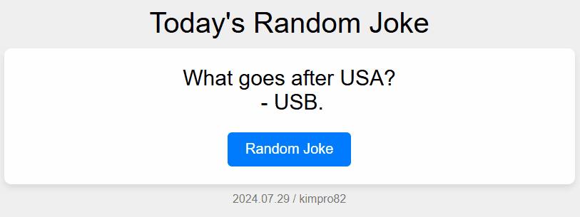

# [My React Practice](../README.md#react)

Do React, but don't be reactive


### \<List>

- [React : Random Joke (2024.07.29)](#react--random-joke-20240729)


## [React : Random Joke (2024.07.29)](#list)

- Initial Practice of React-TypeScript

  

- Development Environment  
  - *npm* 8.19.2 / *react-typescript* 1.0.0 / *tsc* 4.7.4 / *vite* 3.0.4 in [*Replit*](https://replit.com/)

- It isn't rendered in the current Github page.

- Code
  <details>
    <summary>index.html</summary>

  ```html
  <!DOCTYPE html>

  <html lang="en">

  <head>
  <meta charset="UTF-8">
  <meta name="viewport" content="width=device-width, initial-scale=1.0">
  <title>Today's Random Joke</title>
  <link rel="stylesheet" href="/style.css">
  </head>

  <body>
  <div id="root"></div>
  <script type="module" src="/src/index.tsx"></script>
  </body>

  </html>
  ```
  </details>
  <details>
    <summary>style.css</summary>

  ```css
  body {
      font-family: Arial, sans-serif;
      display: flex;
      flex-direction: column;
      justify-content: flex-start;
      align-items: center;
      height: 100vh;
      margin: 0;
      background-color: #f0f0f0;
      padding-top: 20px; /* 화면 상단의 공백 조절 */
    }

    .title {
      font-size: 2em;
      margin-bottom: 10px;
      text-align: center;
    }

    .container {
      text-align: center;
      background-color: #fff;
      padding: 20px;
      border-radius: 8px;
      box-shadow: 0 4px 8px rgba(0, 0, 0, 0.1);
      width: 600px;
    }

    .joke {
      font-size: 1.5em;
      margin-bottom: 20px;
      white-space: pre-wrap; /* Preserve whitespace and handle line breaks */
    }

    button {
      padding: 10px 20px;
      font-size: 1em;
      color: #fff;
      background-color: #007bff;
      border: none;
      border-radius: 5px;
      cursor: pointer;
    }

    button:hover {
      background-color: #0056b3;
    }

    .footer {
      font-size: 0.8em;
      color: #777;
      margin-top: 10px;
      text-align: center;
    }
  ```
  </details>
  <details>
    <summary>src/index.tsx</summary>

  ```tsx
  import React from 'react';
  import ReactDOM from 'react-dom';
  import App from './App';
  import '/style.css';

  ReactDOM.render(<App />, document.getElementById('root'));
  ```
  </details>
  <details>
    <summary>src/App.tsx</summary>

  ```tsx
  import React, { useState, useEffect } from 'react';

  const App: React.FC = () => {
    const [joke, setJoke] = useState<string>('');

    const fetchJoke = async () => {
      try {
        const response = await fetch('https://official-joke-api.appspot.com/random_joke');
        const data = await response.json();
        const formattedJoke = `${data.setup}\n - ${data.punchline}`;
        setJoke(formattedJoke);
      } catch (error) {
        setJoke('Oops! Something went wrong. Please try again.');
      }
    };

    useEffect(() => {
      fetchJoke();
    }, []);

    return (
      <div className="app">
        <div className="title">Today's Random Joke</div>
        <div className="container">
          <div className="joke">{joke}</div>
          <button onClick={fetchJoke}>Random Joke</button>
        </div>
        <div className="footer">2024.07.29 / kimpro82</div>
      </div>
    );
  };

  export default App;
  ```
  </details>
