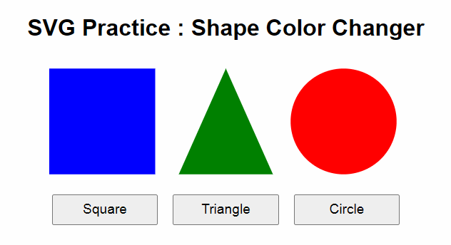

# [My SVG Practice](../README.md#svg)

Super

### \<List>

- [Initial Practice : Shape Color Changer (2024.09.18)](#initial-practice--shape-color-changer-20240918)


## [Initial Practice : Shape Color Changer (2024.09.18)](#list)

- Output

  

- Code
  <details open="">
    <summary>shape.svg</summary>

  ```svg
  <svg xmlns="http://www.w3.org/2000/svg" viewBox="0 0 300 90" width="100%" height="100%">
    <rect id="rect" width="90" height="90" x="0" y="0" fill="blue"/>
    <polygon id="triangle" points="110,90 150,0 190,90" fill="green"/>
    <circle id="circle" cx="250" cy="45" r="45" fill="red"/>
  </svg>
  ```
  </details>
  <details>
    <summary>shape_color_changer.html</summary>

  ```html
  <!doctype html>

  <html lang="en">
    <head>
      <meta charset="UTF-8" />
      <meta name="viewport" content="width=device-width, initial-scale=1.0" />
      <title>SVG Practice : Shape Color Changer</title>
      <link rel="stylesheet" href="shape_color_changer.css" />
      <script defer src="shape_color_changer.js" type="module"></script>
    </head>

    <body>
      <h1>SVG Practice : Shape Color Changer</h1>

      <!-- Embed the external SVG file -->
      <object id="svgObject" type="image/svg+xml" data="shape.svg"></object>

      <!-- Buttons for changing colors of each shape -->
      <div id="buttons">
        <button id="changeRectColor">Square</button>
        <button id="changeTriangleColor">Triangle</button>
        <button id="changeCircleColor">Circle</button>
      </div>
    </body>
  </html>
  ```
  </details>
  <details>
    <summary>shape_color_changer.css</summary>

  ```css
  body {
      font-family: Arial, sans-serif;
      text-align: center;
      margin-top: 5%;
    }
    
    #svgObject {
      margin-top: 2%;
      width: 60%;
    }
    
    #buttons {
      margin-top: 2%;
    }
    
    button {
      margin: 1%;
      padding: 1% 1%;
      width: 18%;
      font-size: 1.2em;
      cursor: pointer;
    }
  ```
  </details>
  <details>
    <summary>shape_color_changer.ts</summary>

  ```ts
  const svgObject = document.getElementById('svgObject') as HTMLObjectElement;
  const changeRectColorBtn = document.getElementById('changeRectColor') as HTMLButtonElement;
  const changeTriangleColorBtn = document.getElementById('changeTriangleColor') as HTMLButtonElement;
  const changeCircleColorBtn = document.getElementById('changeCircleColor') as HTMLButtonElement;
  ```
  ```ts
  /**
   * Generates a random hex color string.
   * 
   * @returns {string} - A random color in hex format (e.g., "#A1B2C3").
   */
  function getRandomColor(): string {
    const letters = '0123456789ABCDEF';
    let color = '#';
    for (let i = 0; i < 6; i++) {
      color += letters[Math.floor(Math.random() * 16)];
    }
    return color;
  }
  ```
  ```ts
  /**
   * Changes the fill color of an SVG shape by its ID.
   * 
   * @param {string} shapeId - The ID of the SVG element to change the color of.
   */
  function changeColor(shapeId: string) {
    const svgDoc = svgObject.contentDocument; // Access the embedded SVG document
    if (svgDoc) {
      const shape = svgDoc.getElementById(shapeId);
      if (shape) {
        shape.setAttribute('fill', getRandomColor()); // Set a new random color
      }
    }
  }
  ```
  ```ts
  // Add event listeners to each button to change the color of the corresponding SVG shape
  changeRectColorBtn.addEventListener('click', () => changeColor('rect'));
  changeTriangleColorBtn.addEventListener('click', () => changeColor('triangle'));
  changeCircleColorBtn.addEventListener('click', () => changeColor('circle'));
  ```
  </details>
