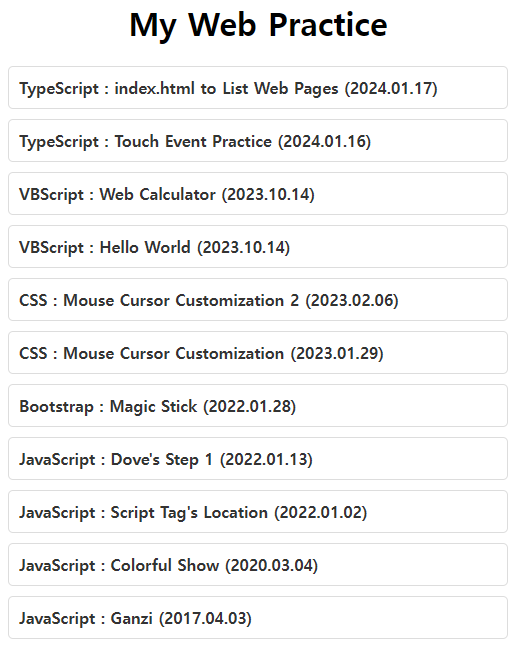
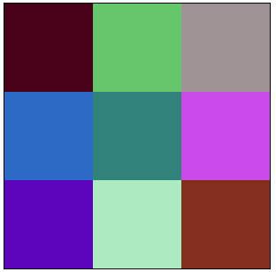

# [My TypeScript Practice](../README.md#typescript)

I heard that no one ignores TypeScript users. However, it was enough for me to be ignored as an individual, even before any programming language.


### \<List>

- [`index.html` to Host Web Pages (2024.01.17)](#indexhtml-to-host-web-pages-20240117)
- [Touch Event Practice (2024.01.16)](#touch-event-practice-20240116)
- [Big Block Lettering in Console (2023.05.28)](#big-block-lettering-in-console-20230528)
- [Hello World (2023.02.28)](#hello-world-20230228)


## [`index.html` to Host Web Pages (2024.01.17)](#list)

- Hosting dynamic web pages within this repository
- Future improvements
  - Attempted to load link data from an external JSON file but failed (Currently, data is directly written within TypeScript file).
  - Need to add brief descriptions for each link.
- Code and Result

  

  <details>
    <summary>/index.html</summary>

  ```html
  <!DOCTYPE html>

  <html lang="en">

  <head>
    <meta charset="UTF-8">
    <meta name="viewport" content="width=device-width, initial-scale=1.0">
    <link rel="stylesheet" href="styles.css">
    <script defer src="main.js"></script>
    <title>kimpro82.github.io - MyWebPractice</title>
  </head>

  <body>
    <div>
      <h1>My Web Practice</h1>
    </div>

    <div class="links-container" id="linksContainer"></div>
  </body>

  </html>
  ```
  </details>
  <details>
    <summary>/styles.css</summary>

  ```css
  body {
    display: flex;
    flex-direction: column;
    align-items: center;
    justify-content: flex-start;
    min-height: 100vh;
    margin: 0;
    }
  ```
  ```css
    .links-container {
      max-width: 500px;
      width: 100%;
    }
  ```
  ```css
    .link-item {
      margin-bottom: 10px;
    }
  ```
  ```css
    .link-item a {
      text-decoration: none;
      color: #333;
      font-weight: bold;
      display: block;
      padding: 10px;
      background-color: #fff;
      border: 1px solid #ddd;
      border-radius: 5px;
      transition: background-color 0.3s;
    }
  ```
  ```css
    .link-item a:hover {
      background-color: #f0f0f0;
    }
  ```
  </details>
  <details>
    <summary>/main.ts</summary>

  ```ts
  interface Link {
    title: string;
    url: string;
    comment: string;
  }

  const linksData: Link[] = [
    {
      title: 'TypeScript : index.html to List Web Pages (2024.01.17)',
      url: '',
      comment: 'This page'
    },
    ……
    {
      title: 'JavaScript : Ganzi (2017.04.03)',
      url: './JavaScript/Ganzi.html',
      comment: ''
    }
  ];
  ```
  ```ts
  document.addEventListener('DOMContentLoaded', () => {
    const linksContainer = document.getElementById('linksContainer');

    if (linksContainer) {
      linksData.forEach((link: { title: string, url: string }) => {
        const linkItem = document.createElement('div');
        linkItem.classList.add('link-item');

        const linkAnchor = document.createElement('a');
        linkAnchor.href = link.url;
        linkAnchor.textContent = link.title;
        linkAnchor.target = '_blank';

        linkItem.appendChild(linkAnchor);
        linksContainer.appendChild(linkItem);
      });
    }
  });
  ```

  </details>
  <details>
    <summary>/links.json</summary>

  ```json
  [
    {
      "title": "TypeScript : index.html to List Web Pages (2024.01.17)",
      "url": "",
      "comment": "This page"
    },
    ……
    {
      "title": "JavaScript : Ganzi (2017.04.03)",
      "url": "./JavaScript/Ganzi.html",
      "comment": ""
    }
  ]
  ```
  </details>


## [Touch Event Practice (2024.01.16)](#list)

- A hands-on exercise for incorporating touch screen functionality into a web page
  - Initial setup for the project [Touch-Color-Changing Tile App for Babies](https://github.com/kimpro82/MyFamilyCare/issues/32)
  - Creation of a 3 * 3 array of grid rectangles, each changing colors randomly and independently
  - Treating both `click` and `touchstart` events as equivalent actions
- Code and Result

  

  <details>
    <summary>TouchScreenExample.html</summary>

  ```html
  <!DOCTYPE html>

  <html lang="en">

  <head>
      <meta charset="UTF-8">
      <meta name="viewport" content="width=device-width, initial-scale=1.0">
      <link rel="stylesheet" href="TouchScreenExample.css">
      <title>Touchscreen Example</title>
      <script defer src="TouchScreenExample.js"></script>
  </head>

  <body>
      <canvas id="myCanvas"></canvas>
  </body>

  </html>
  ```
  </details>
  <details>
    <summary>TouchScreenExample.css</summary>

  ```css
  body
  {
      display: flex;
      align-items: center;
      justify-content: center;
      height: 100vh;
      margin: 0;
  }
  ```
  ```css
  canvas
  {
      border: 1px solid #000;
  }
  ```
  </details>
  <details>
    <summary>TouchScreenExample.ts</summary>

  ```ts
  const canvas = document.getElementById('myCanvas') as HTMLCanvasElement;
  const context = canvas.getContext('2d');

  const numRows = 3;
  const numCols = 3;
  const rectWidth = 100;
  const rectHeight = 100;
  const padding = 0;

  // Initial rectangle properties
  let rectangles: { x: number; y: number; width: number; height: number; color: string }[] = [];
  ```
  ```ts
  // Call the initialization function
  initializeRectangles();

  // Initialize the canvas and draw rectangles
  function drawRectangles() {
      context.clearRect(0, 0, canvas.width, canvas.height);

      // Draw rectangles
      rectangles.forEach((rect) => {
          context.fillStyle = rect.color;
          context.fillRect(rect.x, rect.y, rect.width, rect.height);
      });
  }

  // Initialize grid rectangles
  function initializeRectangles() {
      const totalWidth = numCols * (rectWidth + padding) - padding;
      const totalHeight = numRows * (rectHeight + padding) - padding;

      canvas.width = totalWidth;
      canvas.height = totalHeight;

      const startX = (canvas.width - totalWidth) / 2;
      const startY = (canvas.height - totalHeight) / 2;

      rectangles = [];

      for (let row = 0; row < numRows; row++) {
          for (let col = 0; col < numCols; col++) {
              const x = startX + col * (rectWidth + padding);
              const y = startY + row * (rectHeight + padding);
              const color = getRandomColor();

              rectangles.push({ x, y, width: rectWidth, height: rectHeight, color });
          }
      }

      drawRectangles();
  }
  ```
  ```ts
  // Handle canvas click and touch events
  canvas.addEventListener('click', handleInput);
  canvas.addEventListener('touchstart', handleInput, { passive: true });

  // Handle click and touch events function
  function handleInput(event: MouseEvent | TouchEvent) {
      // Get coordinates based on the event type
      const clientX = 'touches' in event ? event.touches[0].clientX : event.clientX;
      const clientY = 'touches' in event ? event.touches[0].clientY : event.clientY;

      const rect = getClickedRectangle(clientX - canvas.offsetLeft, clientY - canvas.offsetTop);

      if (rect) {
          // Change the color of the clicked rectangle to a random RGB value
          rect.color = getRandomColor();

          // Redraw rectangles with the updated color
          drawRectangles();
      }
  }

  // Find the rectangle at the clicked position (temporary workaround for rectangles.find() error)
  function getClickedRectangle(mouseX: number, mouseY: number) {
      for (let i = 0; i < rectangles.length; i++) {
          const rect = rectangles[i];
          if (
              mouseX >= rect.x &&
              mouseX <= rect.x + rect.width &&
              mouseY >= rect.y &&
              mouseY <= rect.y + rect.height
          ) {
              return rect;
          }
      }
      return null; // No rectangle found at the clicked position
  }

  // Generate a random RGB color value
  function getRandomColor() {
      return `rgb(${Math.floor(Math.random() * 256)}, ${Math.floor(Math.random() * 256)}, ${Math.floor(Math.random() * 256)})`;
  }
  ```
  </details>


## [Big Block Lettering in Console (2023.05.28)](#list)

- Print big block alphabet letters "horizontally" in console (Upper cases only)
  - Reference ☞ Print it "vertically" https://code.sololearn.com/cMjHm80zOip1
- Programming language : ~~Not decided~~ TypeScript
  - Prefer ones that have built-in libraries for handling a specific external data file  
    → Actually installed `js-yaml`
- External data file type : *YML* ~~(Tentative)~~ (Confirmed)
  - Generated by *ChatGPT* (Actually almost all the codes are from *ChatGPT*)
- Future Improvements
  - Understand **asynchronous programming**
  - Add lower cases, numbers and space
  - Enhance design (references)
    - https://github.com/dominikwilkowski/cfonts
    - https://www.itsupportwale.com/blog/print-awesome-ascii-text-in-linux-terminal/
- Code and Result
  ```shell
  tsc TsBigBlockLettering.ts
  node TsBigBlockLettering.js
  ```
  ```
  알파벳 문자열을 입력하세요: uebermensch
  #.....#.#######.######..#######.######..#.....#.#######.#.....#..#####..#######.#.....#.
  #.....#.#.......#.....#.#.......#.....#.##...##.#.......##....#.#.......#.......#.....#.
  #.....#.#.......#.....#.#.......#.....#.#.#.#.#.#.......#.#...#.#.......#.......#.....#.
  #.....#.######..######..######..######..#..#..#.######..#..#..#..#####..#.......#######.
  #.....#.#.......#.....#.#.......#.....#.#.....#.#.......#...#.#.......#.#.......#.....#.
  #.....#.#.......#.....#.#.......#.....#.#.....#.#.......#....##.......#.#.......#.....#.
  #######.#######.######..#######.#.....#.#.....#.#######.#.....#..#####..#######.#.....#.
  ```

  <details>
    <summary>Alphabet.yml</summary>

  ```yml
  A:
    - "#######."
    - "#.....#."
    - "#.....#."
    - "#######."
    - "#.....#."
    - "#.....#."
    - "#.....#."

  ……

  Z:
    - "#######."
    - ".....#.."
    - "....#..."
    - "...#...."
    - "..#....."
    - ".#......"
    - "#######."
  ```
  </details>
  <details>
    <summary>TsBigBlockLettering.ts</summary>

  ```ts
  import * as fs from 'fs';
  import * as yaml from 'js-yaml';
  import * as readline from 'readline';
  ```
  ```ts
  // 입력을 받을 readline.Interface 생성
  const rl = readline.createInterface({
      input: process.stdin,
      output: process.stdout
  });
  ```
  ```ts
  // 알파벳 문자열 입력 받기
  rl.question('알파벳 문자열을 입력하세요: ', (input: string) => {
      rl.close();

      // 입력받은 알파벳 문자를 대문자로 변환
      const upperCaseInput = input.toUpperCase();

      // alphabet.yml 파일 불러오기
      const alphabetData = yaml.load(fs.readFileSync('alphabet.yml', 'utf8'));    // not .safeLoad()

      // 출력용 배열 초기화
      const outputArray: string[] = [];

      // 알파벳 문자열을 출력용 배열에 누적하는 함수
      function accumulateAlphabetString(alphabet: string) {
          const alphabetDataString = alphabetData[alphabet];
          for (let i = 0; i < alphabetDataString.length; i++) {
              const char = alphabetDataString[i];
              if (outputArray[i]) {
                  outputArray[i] += char;
              } else {
                  outputArray[i] = char;
              }
          }
      }

      // 입력받은 알파벳 문자열을 출력용 배열에 누적
      for (let i = 0; i < upperCaseInput.length; i++) {
          const char = upperCaseInput[i];
          if (alphabetData.hasOwnProperty(char)) {
              accumulateAlphabetString(char);
          }
      }

      // 출력용 배열 출력
      if (outputArray.length > 0) {
          for (let i = 0; i < outputArray.length; i++) {
              console.log(outputArray[i]);
          }
      } else {
          console.log('입력한 알파벳 문자열에 해당하는 데이터가 없습니다.');
      }
  });
  ```
  </details>
  <details>
    <summary>tsconfig.json</summary>

  ※ The `fs` library requires execution in a `node`(Node.js) environment, not in a browser one.
  ```ts
  {
      "compilerOptions": {
          "target": "es6",
          "module": "commonjs",
          "moduleResolution": "node",
          "esModuleInterop": true
      }
  }
  ```
  </details>

## [Hello World (2023.02.28)](#list)

- Preparation
  1. Install *node.js*  ☞ download from `https://nodejs.org/ko/`
  2. Install *tsc*      ☞ type `npm install -g typescript` on the terminal
- Write `.ts` file with syntax for types
- Compile it to `.js` file by `tsc.exe` (`.ts` file can't run directly)  
  : `tsc {filename}.ts`
- Code and Result
  <details open="">
    <summary>TsHelloWorld.ts</summary>

  ```ts
  var str : String = "Hello World!"
  console.log(str)
  ```
  </details>
  <details open="">
    <summary>TsHelloWorld.js</summary>

  ```js
  var str = "Hello World!";
  console.log(str);
  ```
  </details>
  Hmm …… it's not so impressive yet.
