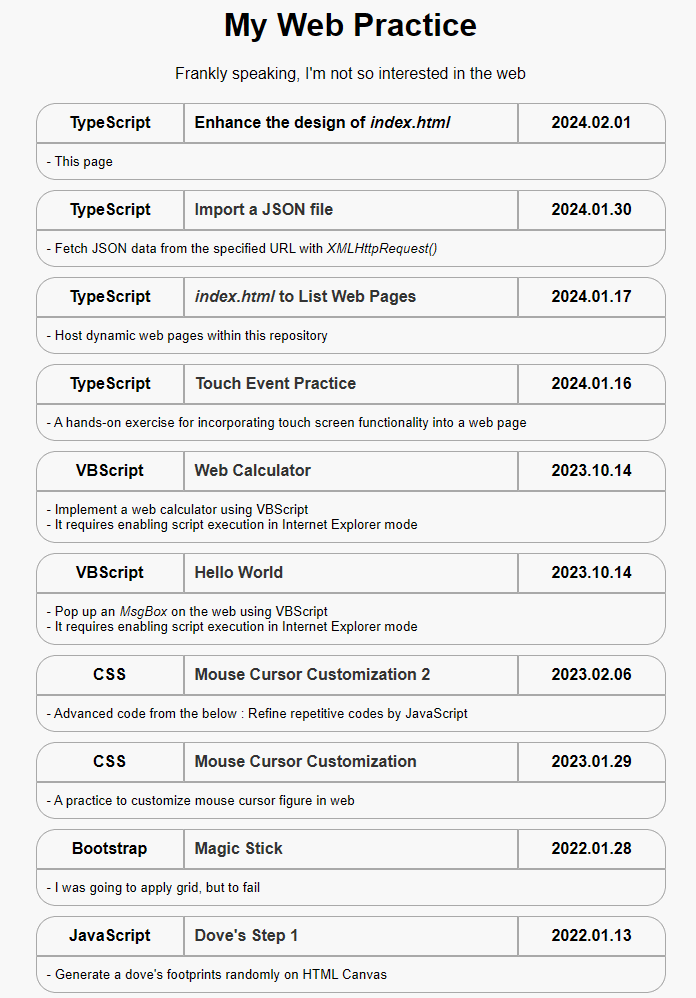
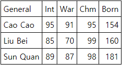

# [My TypeScript Practice](../README.md#typescript)

I heard that no one ignores TypeScript users. However, it was enough for me to be ignored as an individual, even before any programming language.


### \<List>

- [Enhance the design of `index.html` (2024.02.01)](#enhance-the-design-of-indexhtml-20240201)
- [Import a JSON file (2024.01.30)](#import-a-json-file-20240130)
- [`index.html` to Host Web Pages (2024.01.17)](#indexhtml-to-host-web-pages-20240117)
- [Touch Event Practice (2024.01.16)](#touch-event-practice-20240116)
- [Big Block Lettering in Console (2023.05.28)](#big-block-lettering-in-console-20230528)
- [Hello World (2023.02.28)](#hello-world-20230228)


## [Enhance the design of `index.html` (2024.02.01)](#list)

- Better(?) design …… Actually I'm not so curious about the design
- Future improvements
  - Apply `<a>` tags to the entire scope of the `<table>`
  - Add the last updated date
  - Add some footer information
  - Improve the directory structure related the hosting page
- Code and Result

  

  <details>
    <summary>/index.html (mainly changed part)</summary>

  ```html
  ……

  <body>
    <div>
      ……
      Frankly speaking, I'm not so interested in the web
    </div>

    ……
  </body>

  ……
  ```
  </details>
  <details>
    <summary>/styles.css</summary>

  ```css
  /* Body styling for center alignment, width constraints, and font family */
  body {
    text-align: center;
    max-width: 700px;
    min-width: 600px;
    margin: auto;                         /* External margin for center alignment */
    font-family: Arial, sans-serif;
  }
  ```
  ```css
  /* Styling for h1 element with top margin */
  h1 {
    margin-top: 20px;                     /* Add top margin to h1 element */
  }

  /* Flex container for links with space-around justification */
  .links-container {
    margin-top: 20px;                     /* Add margin to separate from h1 */
    display: flex;
    flex-wrap: wrap;
    justify-content: space-around;        /* Arrange items with space around */
  }
  ```
  ```css
  /* Styling for each link item with border, width, margin, and background color */
  .link-item {
    border-collapse: collapse;
    border-radius: 20px;
    width: 90%;
    margin: 0;
    margin-bottom: 10px;
    background-color: whitesmoke;         /* Set background color */
  }
  ```
  ```css
  /* Styling for table cells with border, margin, padding, width, and hover effect */
  td {
    border: 1px solid darkgray;           /* Add border to cells */
    margin: 0;
    padding: 10px;                        /* Add padding to cells */
    width: 100%;
    transition: transform 0.3s ease;      /* Smooth hover effect */
  }
  ```
  ```css
  /* Flex container for the first row with bold text */
  .row1 {
    display: flex;
    font-weight: bold;                    /* Set text to bold */
  }

  /* Styling for category cell with maximum width and rounded border */
  .category-cell {
    max-width: 20%;
    border-top-left-radius: 20px;         /* Rounded top-left border */
  }

  /* Styling for title cell with flex-grow and left text alignment */
  .title-cell {
    flex-grow: 1;                         /* Allow title cell to grow */
    text-align: left;                     /* Left-align text in title cell */
  }

  /* Styling for date cell with maximum width and rounded border */
  .date-cell {
    max-width: 20%;
    border-top-right-radius: 20px;        /* Rounded top-right border */
  }
  ```
  ```css
  .row2 {
    display: flex;                        /* Display second row as a flex container */
  }

  /* Styling for comment cell with left text alignment, rounded borders, and smaller font size */
  .comment-cell {
    flex-grow: 1;                         /* Allow comment cell to grow */
    border-bottom-left-radius: 20px;      /* Rounded bottom-left border */
    border-bottom-right-radius: 20px;     /* Rounded bottom-right border */
    text-align: left;                     /* Left-align text in comment cell */
    font-size: smaller;                   /* Set smaller font size */
  }
  ```
  ```css
  /* Hover effect for link items with scale transformation and background color change */
  .link-item:hover {
    transform: scale(1.05);               /* Enlarge on hover */
    background-color: papayawhip;         /* Change background color on hover */
  }
  ```
  ```css
  /* Styling for anchor (link) with no text decoration and default color */
  a {
    text-decoration: none;                /* Remove underline from links */
    color: #333;                          /* Set default link color */
  }
  ```
  </details>
  <details>
    <summary>/main.ts (mainly changed part)</summary>

  ```ts
  // Interface representing the structure of each link data
  interface Link {
    category: string;
    ……
    date: string;
    ……
  }
  ```
  ```ts
  // Function to fetch link data from links.json using XMLHttpRequest
  const fetchData = () => {
    ……

    xhr.onload = function () {
      if (xhr.status === 200) {
        ……
        renderTable(linksData);
      } ……
    };

    ……
  };
  ```
  ```ts
  // Function to render the link data into tables and append them to the linksContainer
  const renderTable = (linksData: Link[]) => {
    const linksContainer = document.getElementById("linksContainer");

    linksData.forEach((link) => {
      // Create a new table for each link
      const table = document.createElement("table");
      table.classList.add("link-item");

      // Create the first row of the table
      const row1 = document.createElement("tr");
      row1.classList.add("row1");

      // Create cells for category, title, and date
      const categoryCell = document.createElement("td");
      const titleCell = document.createElement("td");
      const dateCell = document.createElement("td");

      // Add appropriate class names to the cells
      categoryCell.classList.add("category-cell");
      titleCell.classList.add("title-cell");
      dateCell.classList.add("date-cell");

      // Populate cell content with link data
      categoryCell.textContent = link.category;
      if (link.url.length > 0) {
        titleCell.innerHTML = `<a href="${link.url}" target="_blank">${link.title}</a>`;
      } else {
        titleCell.innerHTML = `${link.title}`;
      }
      dateCell.textContent = link.date;

      // Append cells to the first row
      row1.appendChild(categoryCell);
      row1.appendChild(titleCell);
      row1.appendChild(dateCell);

      // Append the first row to the table
      table.appendChild(row1);

      // Check if the link has a comment, and if so, create a second row for it
      if (link.comment.length > 0) {
        const row2 = document.createElement("tr");
        const commentCell = document.createElement("td");

        // Add appropriate class name to the comment cell
        row2.classList.add("row2");
        commentCell.classList.add("comment-cell");

        // Set colspan to cover all three columns in the second row
        commentCell.setAttribute("colspan", "3");

        // Populate cell content with link comment
        commentCell.innerHTML = `${link.comment}`;

        // Append the comment cell to the second row
        row2.appendChild(commentCell);

        // Append the second row to the table
        table.appendChild(row2);
      }

      // Append the table to the linksContainer
      linksContainer.appendChild(table);

      // The commented-out section below was an alternative approach but is currently not used in the code.

      // if (link.url.length > 0) {
      //   const linkForTable = document.createElement("a");
      //   // linkForTable.classList.add("link-item");
      //   linkForTable.href = link.url;
      //   linkForTable.target = "_blank";
      //   linkForTable.appendChild(table);
      //   linksContainer.appendChild(linkForTable);
      // } else {
      //   table.classList.add("link-item");
      //   linksContainer.appendChild(table);
      // }
    });
  };
  ```
  </details>
  <details>
    <summary>/links.json</summary>

  ```json
  [
    {
      "category": "TypeScript",
      "title": "Enhance the design of <i>index.html</i>",
      "date": "2024.02.01",
      "url": "",
      "comment": "- This page"
    },
    {
      "category": "TypeScript",
      "title": "Import a JSON file",
      "date": "2024.01.30",
      "url": "./TypeScript/ImportJSON.html",
      "comment": "- Fetch JSON data from the specified URL with <i>XMLHttpRequest()</i>"
    },
    ……
    {
      "category": "JavaScript",
      "title": "Ganzi",
      "date": "2017.04.03",
      "url": "./JavaScript/Ganzi.html",
      "comment": "- An initial Javascript practice"
    }
  ]
  ```
  </details>


## [Import a JSON file (2024.01.30)](#list)

- Success!
- Code and Result

  

  <details>
    <summary>ImportJSON.html</summary>

  ```html
  <html lang="en">

  <head>
    <meta charset="UTF-8">
    <meta name="viewport" content="width=device-width, initial-scale=1.0">
    <link rel="stylesheet" href="ImportJSON.css">
    <script defer src="ImportJSON.js"></script>
    <title>Import JSON file</title>
  </head>

  <body>
  </body>

  </html>
  ```
  </details>
  <details>
    <summary>ImportJSON.css</summary>

  ```css
  table {
      border: 1px solid black;
      border-collapse : collapse;
    }
  ```
  ```css
    td {
      border: 1px solid black;
      padding: 5px;
    }
  ```
  </details>
  <details>
    <summary>ImportJSON.ts</summary>

  ```ts
  /**
  * Performs an HTTP GET request to fetch JSON data from the specified URL.
  * If the request is successful, it calls the renderTable function with the retrieved JSON data.
  * @param {string} url - The URL from which to fetch JSON data.
  */
  const fetchData = (url: string): void => {
    const xhr = new XMLHttpRequest();
    xhr.open("GET", url, true);
    xhr.responseType = "json";

    xhr.onload = function () {
      if (xhr.status === 200) {
        const jsonData: any[] = xhr.response;

        // Call the renderTable function with the retrieved JSON data.
        renderTable(jsonData);
      } else {
        // Log an error if the HTTP request is not successful.
        console.error("Error fetching JSON data. Status:", xhr.status);
      }
    };
    xhr.send();
  };
  ```
  ```ts
  /**
  * Renders a table in the HTML document based on the provided JSON data.
  * If the JSON data is an array, it creates table rows and cells to display the data.
  * The first row contains the keys as column headers.
  * @param {any[]} jsonData - The JSON data to be displayed in the table.
  */
  const renderTable = (jsonData: any[]): void => {
    // Create a table in the HTML document.
    const table = document.createElement("table");
    table.classList.add("my-table");

    // Create table rows.
    jsonData.forEach((general, index) => {
      // Create table cells.
      if (index === 0) {
        // If it is the first row, use keys as column headers.
        const row = document.createElement("tr");
        for (const key of Object.keys(general)) {
          const cell = document.createElement("td");
          cell.textContent = key;
          row.appendChild(cell);
        }
        table.appendChild(row);
      }

      const row = document.createElement("tr");
      for (const key in general) {
        const cell = document.createElement("td");
        // If the value is a number, align it to the right.
        if (!isNaN(general[key])) {
          cell.style.textAlign = "right";
        }
        cell.textContent = general[key];
        row.appendChild(cell);
      }

      table.appendChild(row);
    });

    // Append the table to the HTML document.
    document.body.appendChild(table);
  };
  ```
  ```ts
  // URL for fetching JSON data.
  const dataUrl = "ImportJSON.json";

  // Fetch JSON data and render the table.
  fetchData(dataUrl);
  ```
  </details>
  <details open="">
    <summary>ImportJSON.json</summary>

  ```json
  [
    {
      "General": "Cao Cao",
      "Int": 95,
      "War": 91,
      "Chm": 95,
      "Born": 154
    },
    {
      "General": "Liu Bei",
      "Int": 85,
      "War": 70,
      "Chm": 99,
      "Born": 160
    },
    {
      "General": "Sun Quan",
      "Int": 89,
      "War": 87,
      "Chm": 98,
      "Born": 181
    }
  ]
  ```
  </details>


## [`index.html` to Host Web Pages (2024.01.17)](#list)

- Hosting dynamic web pages within this repository
- Future improvements
  - Attempted to load link data from an external JSON file but failed (Currently, data is directly written within TypeScript file).  
    → [Done (2024.01.30)](../main_20240130.ts)
  - Need to add brief descriptions for each link.  
    → [Done (2024.02.01)](../main.ts)
- Code and Result

  

  <details>
    <summary>/index.html → /index_20240117.html</summary>

  ```html
  <!DOCTYPE html>

  <html lang="en">

  <head>
    <meta charset="UTF-8">
    <meta name="viewport" content="width=device-width, initial-scale=1.0">
    <link rel="stylesheet" href="styles_20240117.css">
    <script defer src="main_20240117.js"></script>
    <title>kimpro82.github.io - MyWebPractice</title>
  </head>

  <body>
    <div>
      <h1>My Web Practice</h1>
    </div>

    <div class="links-container" id="linksContainer"></div>
  </body>

  </html>
  ```
  </details>
  <details>
    <summary>/styles.css → /styles_20240117.css</summary>

  ```css
  body {
    display: flex;
    flex-direction: column;
    align-items: center;
    justify-content: flex-start;
    min-height: 100vh;
    margin: 0;
    }
  ```
  ```css
    .links-container {
      max-width: 500px;
      width: 100%;
    }
  ```
  ```css
    .link-item {
      margin-bottom: 10px;
    }
  ```
  ```css
    .link-item a {
      text-decoration: none;
      color: #333;
      font-weight: bold;
      display: block;
      padding: 10px;
      background-color: #fff;
      border: 1px solid #ddd;
      border-radius: 5px;
      transition: background-color 0.3s;
    }
  ```
  ```css
    .link-item a:hover {
      background-color: #f0f0f0;
    }
  ```
  </details>
  <details>
    <summary>/main.ts → /main_20240117.css</summary>

  ```ts
  interface Link {
    title: string;
    url: string;
    comment: string;
  }

  const linksData: Link[] = [
    {
      title: 'TypeScript : index.html to List Web Pages (2024.01.17)',
      url: '',
      comment: 'This page'
    },
    ……
    {
      title: 'JavaScript : Ganzi (2017.04.03)',
      url: './JavaScript/Ganzi.html',
      comment: ''
    }
  ];
  ```
  ```ts
  document.addEventListener('DOMContentLoaded', () => {
    const linksContainer = document.getElementById('linksContainer');

    if (linksContainer) {
      linksData.forEach((link: { title: string, url: string }) => {
        const linkItem = document.createElement('div');
        linkItem.classList.add('link-item');

        const linkAnchor = document.createElement('a');
        linkAnchor.href = link.url;
        linkAnchor.textContent = link.title;
        linkAnchor.target = '_blank';

        linkItem.appendChild(linkAnchor);
        linksContainer.appendChild(linkItem);
      });
    }
  });
  ```

  </details>
  <details>
    <summary>/links.json</summary>

  ```json
  [
    {
      "title": "TypeScript : index.html to List Web Pages (2024.01.17)",
      "url": "",
      "comment": "This page"
    },
    ……
    {
      "title": "JavaScript : Ganzi (2017.04.03)",
      "url": "./JavaScript/Ganzi.html",
      "comment": ""
    }
  ]
  ```
  </details>


## [Touch Event Practice (2024.01.16)](#list)

- A hands-on exercise for incorporating touch screen functionality into a web page
  - Initial setup for the project [Touch-Color-Changing Tile App for Babies](https://github.com/kimpro82/MyFamilyCare/issues/32)
  - Creation of a 3 * 3 array of grid rectangles, each changing colors randomly and independently
  - Treating both `click` and `touchstart` events as equivalent actions
- Code and Result

  

  <details>
    <summary>TouchScreenExample.html</summary>

  ```html
  <!DOCTYPE html>

  <html lang="en">

  <head>
      <meta charset="UTF-8">
      <meta name="viewport" content="width=device-width, initial-scale=1.0">
      <link rel="stylesheet" href="TouchScreenExample.css">
      <title>Touchscreen Example</title>
      <script defer src="TouchScreenExample.js"></script>
  </head>

  <body>
      <canvas id="myCanvas"></canvas>
  </body>

  </html>
  ```
  </details>
  <details>
    <summary>TouchScreenExample.css</summary>

  ```css
  body
  {
      display: flex;
      align-items: center;
      justify-content: center;
      height: 100vh;
      margin: 0;
  }
  ```
  ```css
  canvas
  {
      border: 1px solid #000;
  }
  ```
  </details>
  <details>
    <summary>TouchScreenExample.ts</summary>

  ```ts
  const canvas = document.getElementById('myCanvas') as HTMLCanvasElement;
  const context = canvas.getContext('2d');

  const numRows = 3;
  const numCols = 3;
  const rectWidth = 100;
  const rectHeight = 100;
  const padding = 0;

  // Initial rectangle properties
  let rectangles: { x: number; y: number; width: number; height: number; color: string }[] = [];
  ```
  ```ts
  // Call the initialization function
  initializeRectangles();

  // Initialize the canvas and draw rectangles
  function drawRectangles() {
      context.clearRect(0, 0, canvas.width, canvas.height);

      // Draw rectangles
      rectangles.forEach((rect) => {
          context.fillStyle = rect.color;
          context.fillRect(rect.x, rect.y, rect.width, rect.height);
      });
  }

  // Initialize grid rectangles
  function initializeRectangles() {
      const totalWidth = numCols * (rectWidth + padding) - padding;
      const totalHeight = numRows * (rectHeight + padding) - padding;

      canvas.width = totalWidth;
      canvas.height = totalHeight;

      const startX = (canvas.width - totalWidth) / 2;
      const startY = (canvas.height - totalHeight) / 2;

      rectangles = [];

      for (let row = 0; row < numRows; row++) {
          for (let col = 0; col < numCols; col++) {
              const x = startX + col * (rectWidth + padding);
              const y = startY + row * (rectHeight + padding);
              const color = getRandomColor();

              rectangles.push({ x, y, width: rectWidth, height: rectHeight, color });
          }
      }

      drawRectangles();
  }
  ```
  ```ts
  // Handle canvas click and touch events
  canvas.addEventListener('click', handleInput);
  canvas.addEventListener('touchstart', handleInput, { passive: true });

  // Handle click and touch events function
  function handleInput(event: MouseEvent | TouchEvent) {
      // Get coordinates based on the event type
      const clientX = 'touches' in event ? event.touches[0].clientX : event.clientX;
      const clientY = 'touches' in event ? event.touches[0].clientY : event.clientY;

      const rect = getClickedRectangle(clientX - canvas.offsetLeft, clientY - canvas.offsetTop);

      if (rect) {
          // Change the color of the clicked rectangle to a random RGB value
          rect.color = getRandomColor();

          // Redraw rectangles with the updated color
          drawRectangles();
      }
  }

  // Find the rectangle at the clicked position (temporary workaround for rectangles.find() error)
  function getClickedRectangle(mouseX: number, mouseY: number) {
      for (let i = 0; i < rectangles.length; i++) {
          const rect = rectangles[i];
          if (
              mouseX >= rect.x &&
              mouseX <= rect.x + rect.width &&
              mouseY >= rect.y &&
              mouseY <= rect.y + rect.height
          ) {
              return rect;
          }
      }
      return null; // No rectangle found at the clicked position
  }

  // Generate a random RGB color value
  function getRandomColor() {
      return `rgb(${Math.floor(Math.random() * 256)}, ${Math.floor(Math.random() * 256)}, ${Math.floor(Math.random() * 256)})`;
  }
  ```
  </details>


## [Big Block Lettering in Console (2023.05.28)](#list)

- Print big block alphabet letters "horizontally" in console (Upper cases only)
  - Reference ☞ Print it "vertically" https://code.sololearn.com/cMjHm80zOip1
- Programming language : ~~Not decided~~ TypeScript
  - Prefer ones that have built-in libraries for handling a specific external data file  
    → Actually installed `js-yaml`
- External data file type : *YML* ~~(Tentative)~~ (Confirmed)
  - Generated by *ChatGPT* (Actually almost all the codes are from *ChatGPT*)
- Future Improvements
  - Understand **asynchronous programming**
  - Add lower cases, numbers and space
  - Enhance design (references)
    - https://github.com/dominikwilkowski/cfonts
    - https://www.itsupportwale.com/blog/print-awesome-ascii-text-in-linux-terminal/
- Code and Result
  ```shell
  tsc TsBigBlockLettering.ts
  node TsBigBlockLettering.js
  ```
  ```
  알파벳 문자열을 입력하세요: uebermensch
  #.....#.#######.######..#######.######..#.....#.#######.#.....#..#####..#######.#.....#.
  #.....#.#.......#.....#.#.......#.....#.##...##.#.......##....#.#.......#.......#.....#.
  #.....#.#.......#.....#.#.......#.....#.#.#.#.#.#.......#.#...#.#.......#.......#.....#.
  #.....#.######..######..######..######..#..#..#.######..#..#..#..#####..#.......#######.
  #.....#.#.......#.....#.#.......#.....#.#.....#.#.......#...#.#.......#.#.......#.....#.
  #.....#.#.......#.....#.#.......#.....#.#.....#.#.......#....##.......#.#.......#.....#.
  #######.#######.######..#######.#.....#.#.....#.#######.#.....#..#####..#######.#.....#.
  ```

  <details>
    <summary>Alphabet.yml</summary>

  ```yml
  A:
    - "#######."
    - "#.....#."
    - "#.....#."
    - "#######."
    - "#.....#."
    - "#.....#."
    - "#.....#."

  ……

  Z:
    - "#######."
    - ".....#.."
    - "....#..."
    - "...#...."
    - "..#....."
    - ".#......"
    - "#######."
  ```
  </details>
  <details>
    <summary>TsBigBlockLettering.ts</summary>

  ```ts
  import * as fs from 'fs';
  import * as yaml from 'js-yaml';
  import * as readline from 'readline';
  ```
  ```ts
  // 입력을 받을 readline.Interface 생성
  const rl = readline.createInterface({
      input: process.stdin,
      output: process.stdout
  });
  ```
  ```ts
  // 알파벳 문자열 입력 받기
  rl.question('알파벳 문자열을 입력하세요: ', (input: string) => {
      rl.close();

      // 입력받은 알파벳 문자를 대문자로 변환
      const upperCaseInput = input.toUpperCase();

      // alphabet.yml 파일 불러오기
      const alphabetData = yaml.load(fs.readFileSync('alphabet.yml', 'utf8'));    // not .safeLoad()

      // 출력용 배열 초기화
      const outputArray: string[] = [];

      // 알파벳 문자열을 출력용 배열에 누적하는 함수
      function accumulateAlphabetString(alphabet: string) {
          const alphabetDataString = alphabetData[alphabet];
          for (let i = 0; i < alphabetDataString.length; i++) {
              const char = alphabetDataString[i];
              if (outputArray[i]) {
                  outputArray[i] += char;
              } else {
                  outputArray[i] = char;
              }
          }
      }

      // 입력받은 알파벳 문자열을 출력용 배열에 누적
      for (let i = 0; i < upperCaseInput.length; i++) {
          const char = upperCaseInput[i];
          if (alphabetData.hasOwnProperty(char)) {
              accumulateAlphabetString(char);
          }
      }

      // 출력용 배열 출력
      if (outputArray.length > 0) {
          for (let i = 0; i < outputArray.length; i++) {
              console.log(outputArray[i]);
          }
      } else {
          console.log('입력한 알파벳 문자열에 해당하는 데이터가 없습니다.');
      }
  });
  ```
  </details>
  <details>
    <summary>tsconfig.json</summary>

  ※ The `fs` library requires execution in a `node`(Node.js) environment, not in a browser one.
  ```ts
  {
      "compilerOptions": {
          "target": "es6",
          "module": "commonjs",
          "moduleResolution": "node",
          "esModuleInterop": true
      }
  }
  ```
  </details>

## [Hello World (2023.02.28)](#list)

- Preparation
  1. Install *node.js*  ☞ download from `https://nodejs.org/ko/`
  2. Install *tsc*      ☞ type `npm install -g typescript` on the terminal
- Write `.ts` file with syntax for types
- Compile it to `.js` file by `tsc.exe` (`.ts` file can't run directly)  
  : `tsc {filename}.ts`
- Code and Result
  <details open="">
    <summary>TsHelloWorld.ts</summary>

  ```ts
  var str : String = "Hello World!"
  console.log(str)
  ```
  </details>
  <details open="">
    <summary>TsHelloWorld.js</summary>

  ```js
  var str = "Hello World!";
  console.log(str);
  ```
  </details>
  Hmm …… it's not so impressive yet.
