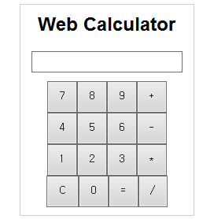
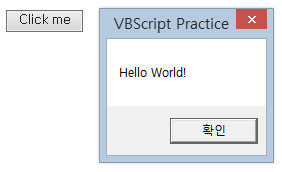

# [My VBScript Practice](../README.md#vbscript)

VB never dies …… !


### \<List>

- [VBScript : Web Calculator (2023.10.14)](#vbscript--web-calculator-20231014)
- [VBScript : Hello World (2023.10.14)](#vbscript--hello-world-20231014)


## [VBScript : Web Calculator (2023.10.14)](#list)

- Implement a web calculator using *VBScript*
- *Internet Explorer* mode does not support modern *CSS* features, especially like `grid`
- Codes and Results  
  
  <details>
    <summary>VbsCalculator.html</summary>

  ```html
  <!DOCTYPE html>
  <html>

  <head>
    <title>Web Calculator with VBScript</title>
    <link rel="stylesheet" type="text/css" href="VbsCalculator.css">
    <script type="text/vbscript" src="VbsCalculator.vbs"></script>
  </head>

  <body>
    <div class="calculator">
      <h2>Web Calculator</h2>
      <input type="text" id="display" readonly>
      <div class="keys">
        <button onclick="appendToDisplay('7')">7</button>
        <button onclick="appendToDisplay('8')">8</button>
        <button onclick="appendToDisplay('9')">9</button>
        <button onclick="appendToDisplay('+')">+</button><br>
        <button onclick="appendToDisplay('4')">4</button>
        <button onclick="appendToDisplay('5')">5</button>
        <button onclick="appendToDisplay('6')">6</button>
        <button onclick="appendToDisplay('-')">-</button><br>
        <button onclick="appendToDisplay('1')">1</button>
        <button onclick="appendToDisplay('2')">2</button>
        <button onclick="appendToDisplay('3')">3</button>
        <button onclick="appendToDisplay('*')">*</button><br>
        <button onclick="clearDisplay()">C</button>
        <button onclick="appendToDisplay('0')">0</button>
        <button onclick="calculateResult()">=</button>
        <button onclick="appendToDisplay('/')">/</button>
      </div>
    </div>
  </body>

  </html>
  ```
  </details>
  <details>
    <summary>VbsCalculator.css</summary>

  ```css
  body {
      text-align: center;
      font-family: Arial, sans-serif;
    }

    .calculator {
      width: 200px;
      margin: 0 auto;
      border: 1px solid #ccc;
      padding: 10px;
    }

    input[type="text"] {
      width: 90%;
      margin-bottom: 10px;
      padding: 5px;
    }

    /* It seems not to work in IE mode */
    /* .keys {
      display: grid;
      grid-template-columns: repeat(4, 1fr);
      gap: 5px;
    } */

    button {
      padding: 10px;
    }
  ```
  </details>
  <details>
    <summary>VbsCalculator.vbs</summary>

  ```vbs
  Function appendToDisplay(value)

    document.getElementById("display").value = document.getElementById("display").value & value

  End Function


  Function clearDisplay()

    document.getElementById("display").value = ""

  End Function


  Function calculateResult()

    On Error Resume Next

      result = Eval(document.getElementById("display").value)

      If Err.Number = 0 Then
          document.getElementById("display").value = result
      Else
          document.getElementById("display").value = "Error"
      End If

    On Error GoTo 0

  End Function
  ```
  </details>


## [VBScript : Hello World (2023.10.14)](#list)

- Pop up an `MsgBox` on the web using *VBScript*
- It shares almost identical syntax with *Visual BASIC* (before *.NET*)
- It requires enabling script execution in *Internet Explorer* mode
- Codes and Results  
  

  <details>
    <summary>VbsHelloWorld.html</summary>

  ```html
  <!DOCTYPE html>
  <html>

  <head>
    <title>VBScript Practice</title>
    <script type="text/vbscript" src="VbsHelloWorld.vbs"></script>
    <!-- In Internet Explorer mode, scripting must be allowed for it to work. -->
  </head>

  <body>
    <button onclick="SayHello()">Click me</button>
  </body>

  </html>
  ```
  </details>
  <details>
    <summary>VbsHelloWorld.vbs</summary>

  ```vbs
  Sub SayHello()

    MsgBox "Hello World!", , "VBScript Practice"

  End Sub
  ```
  </details>
