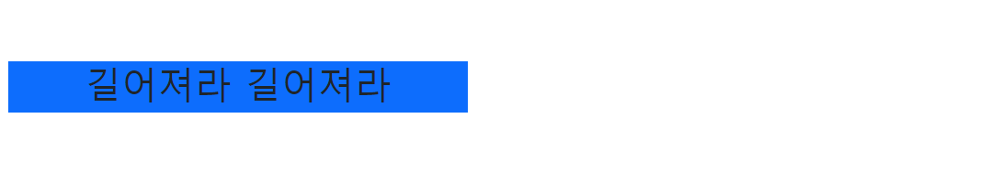

# [My Web Practice](../README.md#my-web-practice)

HTML, CSS and JavaScript


### List

- [TypeScript : Big Block Lettering in Console (2023.05.28)](#typescript--big-block-lettering-in-console-20230528)
- [TypeScript : Hello World (2023.02.28)](#typescript--hello-world-20230228)
- [Mouse Cursor Customization 2 (2023.02.06)](#mouse-cursor-customization-2-20230206)
- [Mouse Cursor Customization (2023.01.29)](#mouse-cursor-customization-20230129)
- [Bootstrap : Magic Stick (2022.01.28)](#bootstrap--magic-stick-20220128)
- [Dove's Step 1 (2022.01.13)](#doves-step-1-20220113)
- [Script Tag's Location (2022.01.02)](#script-tags-location-20220102)
- [Colorful Show (2020.03.04)](#colorful-show-20200304)
- [Ganzi (2017.04.03)](#ganzi-20170403)


## [TypeScript : Big Block Lettering in Console (2023.05.28)](#list)

- Print big block alphabet letters "horizontally" in console (Upper cases only)
  - Reference ☞ Print it "vertically" https://code.sololearn.com/cMjHm80zOip1
- Programming language : ~~Not decided~~ TypeScript
  - Prefer ones that have built-in libraries for handling a specific external data file  
    → Actually installed `js-yaml`
- External data file type : *YML* ~~(Tentative)~~ (Confirmed)
  - Generated by *ChatGPT* (Actually almost all the codes are from *ChatGPT*)
- Future Improvements
  - Understand **asynchronous programming**
  - Add lower cases, numbers and space
  - Enhance design (references)
    - https://github.com/dominikwilkowski/cfonts
    - https://www.itsupportwale.com/blog/print-awesome-ascii-text-in-linux-terminal/
- Results
  ```shell
  tsc TsBigBlockLettering.ts
  node TsBigBlockLettering.js
  ```
  ```
  알파벳 문자열을 입력하세요: uebermensch
  #.....#.#######.######..#######.######..#.....#.#######.#.....#..#####..#######.#.....#.
  #.....#.#.......#.....#.#.......#.....#.##...##.#.......##....#.#.......#.......#.....#.
  #.....#.#.......#.....#.#.......#.....#.#.#.#.#.#.......#.#...#.#.......#.......#.....#.
  #.....#.######..######..######..######..#..#..#.######..#..#..#..#####..#.......#######.
  #.....#.#.......#.....#.#.......#.....#.#.....#.#.......#...#.#.......#.#.......#.....#.
  #.....#.#.......#.....#.#.......#.....#.#.....#.#.......#....##.......#.#.......#.....#.
  #######.#######.######..#######.#.....#.#.....#.#######.#.....#..#####..#######.#.....#.
  ```

  <details>
    <summary>Codes : Alphabet.yml</summary>

  ```yml
  A:
    - "#######."
    - "#.....#."
    - "#.....#."
    - "#######."
    - "#.....#."
    - "#.....#."
    - "#.....#."

  ……

  Z:
    - "#######."
    - ".....#.."
    - "....#..."
    - "...#...."
    - "..#....."
    - ".#......"
    - "#######."
  ```
  </details>
  <details>
    <summary>Codes : TsBigBlockLettering.ts</summary>

  ```ts
  import * as fs from 'fs';
  import * as yaml from 'js-yaml';
  import * as readline from 'readline';
  ```
  ```ts
  // 입력을 받을 readline.Interface 생성
  const rl = readline.createInterface({
      input: process.stdin,
      output: process.stdout
  });
  ```
  ```ts
  // 알파벳 문자열 입력 받기
  rl.question('알파벳 문자열을 입력하세요: ', (input: string) => {
      rl.close();

      // 입력받은 알파벳 문자를 대문자로 변환
      const upperCaseInput = input.toUpperCase();

      // alphabet.yml 파일 불러오기
      const alphabetData = yaml.load(fs.readFileSync('alphabet.yml', 'utf8'));    // not .safeLoad()

      // 출력용 배열 초기화
      const outputArray: string[] = [];

      // 알파벳 문자열을 출력용 배열에 누적하는 함수
      function accumulateAlphabetString(alphabet: string) {
          const alphabetDataString = alphabetData[alphabet];
          for (let i = 0; i < alphabetDataString.length; i++) {
              const char = alphabetDataString[i];
              if (outputArray[i]) {
                  outputArray[i] += char;
              } else {
                  outputArray[i] = char;
              }
          }
      }

      // 입력받은 알파벳 문자열을 출력용 배열에 누적
      for (let i = 0; i < upperCaseInput.length; i++) {
          const char = upperCaseInput[i];
          if (alphabetData.hasOwnProperty(char)) {
              accumulateAlphabetString(char);
          }
      }

      // 출력용 배열 출력
      if (outputArray.length > 0) {
          for (let i = 0; i < outputArray.length; i++) {
              console.log(outputArray[i]);
          }
      } else {
          console.log('입력한 알파벳 문자열에 해당하는 데이터가 없습니다.');
      }
  });
  ```
  </details>
  <details>
    <summary>Codes : tsconfig.json</summary>

  ※ The `fs` library requires execution in a `node`(Node.js) environment, not in a browser one.
  ```ts
  {
      "compilerOptions": {
          "target": "es6",
          "module": "commonjs",
          "moduleResolution": "node",
          "esModuleInterop": true
      }
  }
  ```
  </details>

## [TypeScript : Hello World (2023.02.28)](#list)

- Preparation
  1. Install *node.js*  ☞ download from `https://nodejs.org/ko/`
  2. Install *tsc*      ☞ type `npm install -g typescript` on the terminal
- Write `.ts` file with syntax for types
- Compile it to `.js` file by `tsc.exe` (`.ts` file can't run directly)  
  : `tsc {filename}.ts`

  <details open="">
    <summary>Codes : TsHelloWorld.ts</summary>

  ```ts
  var str : String = "Hello World!"
  console.log(str)
  ```
  </details>
  <details open="">
    <summary>Codes : TsHelloWorld.js</summary>

  ```js
  var str = "Hello World!";
  console.log(str);
  ```
  </details>
  Hmm …… it's not so impressive yet.


## [Mouse Cursor Customization 2 (2023.02.06)](#list)

- Advanced code from [Mouse Cursor Customization (2023.01.29)](#mouse-cursor-customization-20230129)
  - Refine repetitive codes by *JavaScript* : use `.createElement()` `.style.cursor` `.appendChild()`
  - Update keywords from the reference : [[mdn web docs] References > CSS > cursor](https://developer.mozilla.org/en-US/docs/Web/CSS/cursor)
- Future tasks : Move the cursor by *AutoHotKey* automatically

  

  <details>
    <summary>Codes : Cursor2.html (mainly changed)</summary>

  ```html
      <head>
          ……
          <script defer src="./Cursor2.js" type="text/javascript"></script>
          ……
      </head>
  ```
  ```html
      <body>
          <div id="box">
              <h2>Mouse Cursor Customization 2</h2>
              <!-- Elements will be added by js -->
          </div>
          ……
      </body>
  ```
  </details>

  <details>
    <summary>Codes : Cursor2.css (mainly changed)</summary>

  ```css
  /* All blocks for classes related with cursor have been removed in CSS file. */
  ```
  </details>

  <details>
    <summary>Codes : Cursor2.js (new)</summary>

  ```js
  // Declare an array of kewords for cursor property
  // Reference ☞ https://developer.mozilla.org/en-US/docs/Web/CSS/cursor
  var cursorTypes = [
      ["auto", "default", "none"],
      ["context-menu", "help", "pointer", "progress", "wait"],
      ["cell", "crosshair", "text", "vertical-text"],
      ["alias", "copy", "move"],
      ["no-drop", "not-allowed", "grab", "grabbing"],
      ["n-resize", "e-resize", "s-resize", "w-resize"],
      ["ne-resize", "nw-resize", "se-resize", "sw-resize"],
      ["ew-resize", "ns-resize", "nesw-resize", "nwse-resize"],
      ["zoom-in", "zoom-out"]
  ]

  // A function to generate span elements with inner text and cursor style
  function genBoxes(cursorTypes)
  {
      // Declare an object to indicate the element where new elements will be appended
      var obj = document.getElementById("box")

      // Loop for the array cursorTypes
      for (r in cursorTypes)
      {
          for (el in cursorTypes[r])
          {
              // Test : ok
              // console.log(cursorTypes[r][el])

              // Generate a box with style
              var newBox = document.createElement("span")
              // newBox.className = cursorTypes[r][el]                            // not needed
              newBox.innerText = cursorTypes[r][el]
              newBox.style.cursor = cursorTypes[r][el]

              // Append it
              obj.appendChild(newBox)
          }

          // Line replacement
          var br = document.createElement("br")
          obj.appendChild(br)
      }
  }

  // Run
  genBoxes(cursorTypes)
  ```
  </details>


## [Mouse Cursor Customization (2023.01.29)](#list)

- A practice to customize mouse cursor figure in web
- Reference  
  : [[Sololearn] CSS > Properties> 34. Customizing the Mouse Cursor > The cursor Property Values](https://www.sololearn.com/learning/1023/1110/1291/1)
- Future tasks  
  · Refine repetitive codes by *JavaScript* or such → [(done)](#mouse-cursor-customization-2-20230206)  
  · Move the cursor by *AutoHotKey* automatically

  

  <details>
    <summary>Codes : Cursor.html</summary>

  ```html
  <!DOCTYPE html>

  <html lang="en">

      <head>
          <meta charset="utf-8">
          <title>Mouse Cursor Customization</title>
          <meta name="author" content="kimpro82">
          <link rel="stylesheet" href="./Cursor.css">
      </head>

      <body>
          <div id="box">
              <h2>Mouse Cursor Customization</h2>

              <br>

              <span class="auto">auto</span>
              <span class="crosshair">crosshair</span>
              <span class="default">default</span>
              <span class="help">help</span>
              <span class="text">text</span>
              <span class="wait">wait</span>

              <br>

              <span class="n-resize">n-resize</span>
              <span class="s-resize">s-resize</span>
              <span class="ne-resize">ne-resize</span>
              <span class="sw-resize">sw-resize</span>
              
              <br>

              <span class="nw-resize">nw-resize</span>
              <span class="se-resize">se-resize</span>
              <span class="e-resize">e-resize</span>
              <span class="w-resize">w-resize</span>

              <br>

              <span class="pointer">pointer</span>
              <span class="progress">progress</span>
              <span class="not-allowed">not-allowed</span>
              <span class="no-drop">no-drop</span>

              <br>

              <span class="vertical-text">vertical-text</span>
              <span class="all-scroll">all-scroll</span>
              <span class="col-resize">col-resize</span>
              <span class="row-resize">row-resize</span>
          </div>

          <br>
          &nbsp;                                              <!-- to stay cursor when capture -->
      </body>

  </html>
  ```
  </details>

  <details>
    <summary>Codes : Cursor.css</summary>

  ```css
  @charset "EUC-KR";

  body
  {
      font-weight: bold;
  }

  #box
  {
      text-align: center;
      display: inline-block;
      border: 1px solid;
      padding: 5px;
      margin: 5px;
  }

  span
  {
      display: inline-block;
      border: 1px solid;
      padding: 5px;
      margin: 5px;
  }

  .auto           { cursor: auto;         }
  .crosshair      { cursor: crosshair;    }
  .default        { cursor: default;      }
  .help           { cursor: help;         }
  .text           { cursor: text;         }
  .wait           { cursor: wait;         }

  .n-resize       { cursor: n-resize;     }
  .s-resize       { cursor: s-resize;     }
  .ne-resize      { cursor: ne-resize;    }
  .sw-resize      { cursor: sw-resize;    }
  .nw-resize      { cursor: nw-resize;    }
  .se-resize      { cursor: se-resize;    }
  .e-resize       { cursor: e-resize;     }
  .w-resize       { cursor: w-resize;     }

  .pointer        { cursor: pointer;      }
  .progress       { cursor: progress;     }
  .not-allowed    { cursor: not-allowed;  }
  .no-drop        { cursor: no-drop;      }
  .vertical-text  { cursor: vertical-text;}
  .all-scroll     { cursor: all-scroll;   }
  .col-resize     { cursor: col-resize;   }
  .row-resize     { cursor: row-resize;   }
  ```
  </details>


## [Bootstrap : Magic Stick (2022.01.28)](#list)

- A practice of **Bootstrap** (5.1.3) : use `container-fluid` `mx` `my` `row` `col`
- Originally I was going to apply **grid**, but to fail.

  

  <details>
    <summary>Codes : BootstrapMagicStick.html</summary>

  ```html
  ……
      <head>
          <meta charset="UTF-8">
          <title>Magic Stick by Bootstrap</title>
          <link href="./bootstrap5/css/bootstrap.min.css" rel="stylesheet" type="text/css">
          <script defer src="BootstrapMagicStick.js" type="text/javascript"></script>
      </head>

      <body>
          <div class="container-fluid mx-3 my-5">
              <div class="row">
                  <div class="col bg-primary text-center">
                      <h1><span id="text">여의봉아 여의봉아</span></h1>
                  </div>
              </div>
          </div>
      </body>
  ……
  ```
  </details>

  <details>
    <summary>Codes : BootstrapMagicStick.js</summary>

  ```js
  var direction = false;
  var width = 400;
  // console.log(width);

  function resize()
  {
      // Set direction and text content
      if (width < 450 && direction == false)
      {
          direction = !direction;
          document.getElementById("text").textContent = "길어져라 길어져라";
      }
      else if (width > 1000 && direction == true)
      {
          direction = !direction;
          document.getElementById("text").textContent = "짧아져라 짧아져라";
      }

      // Modify the body's width
      if (direction == true) { document.body.style.width = (Number(width) + 50) + 'px' }
      else  { document.body.style.width = (Number(width) - 50) + 'px'}

      width = document.body.style.width.replace(/[^0-9]/g, "");
      console.log(direction, width);
  }

  setInterval(resize, 100);
  ```
  </details>


## [Dove's Step 1 (2022.01.13)](#list)

### Done

- Generate random footprints on **HTML Canvas**
- Draw the `canvas`' edges rounded with `border-radius` in **CSS**
- Get position (x, y) on `canvas` that is located relatively
- Draw footprints in detail with **trigonometric function**

### To-be

- ~~Draw random footprints on **HTML Canvas**~~ (done)
- Draw them more naturally with angle and speed
- Make them disappear gradually like ont the natural snowfield

  

  <details>
    <summary>Codes : DoveStep.html</summary>

  ```html
  <!doctype html>

  <html lang="en">

      <head>

          <meta charset="utf-8">

          <title>Dove Step Simulation</title>
          <meta name="author" content="kimpro82">

          <link rel="stylesheet" href="DoveStep.css">
          <script defer src="DoveStep.js"></script>

      </head>

      <body>

          <p id="title">Dove's Step Simulation</p>

          <canvas id="canvas" width=600 height=600></canvas>
          <!-- It is necessary to fill width and height in HTML for dealing it with js -->

      </body>

  </html>
  ```
  </details>

  <details>
    <summary>Codes : DoveStep.css</summary>

  ```css
  body
  {
      text-align: center;
      font-size: 10px;
  }
  ```
  ```css
  #title
  {
      margin-top: 8rem;
      font-size: 4.5rem;
      margin-bottom: 1rem;

      font-family: Brush Script MT, Georgia, Garamond, Times New Roman, serif;

      color: crimson;
      text-shadow: 0.2rem 0.2rem 0.5rem black;
  }
  ```
  ```css
  #canvas
  {
      width: 600px;
      height: 600px;

      background-color: white;

      border: 1px solid gray;
      border-radius: 40px;

      box-shadow: 0.2rem 0.2rem 0.5rem;
  }
  ```
  </details>

  <details>
    <summary>Codes : DoveStep.js</summary>

  ```js
  // Declare global variables
  const canvas = document.getElementById("canvas");
  const ctx = canvas.getContext("2d");
  var x = -1, y = -1, direction = 0, step = 0;
  var interval = 1000;
  ```
  ```js
  // Start with a click on the canvas
  canvas.onclick = function(event)
  {
      x = event.clientX - ctx.canvas.offsetLeft;
      y = event.clientY - ctx.canvas.offsetTop;
      // test
      console.log("click point :", x, y);

      footPrint();
  }
  ```
  ```js
  // Determine where the next step is located
  function randomWalk()
  {
      if (x >= 0)
      {
          if (step > 19)
          {
              alert("The dove has archieved " + step + " steps. It became a budda and flied away!");
              return -1;
          }
          else
          {
              x = Math.round(Math.random() * 560) + 20;
              y = Math.round(Math.random() * 560) + 20;
              direction = Math.floor(Math.random() * 360);    // 0 ~ 359

              footPrint();
          }
      }
  }
  ```
  ```js
  // Figure the foot print in detail
  function footPrint()
  {
      var angles = [45, 90, 135, 270];
      ctx.beginPath();
      for (let i = 0; i < 4; i++)
      {
          ctx.moveTo(x, y);
          var x2 = x - Math.round(Math.cos(Math.PI * (angles[i] + direction) / 180) * 20);
          var y2 = y - Math.round(Math.sin(Math.PI * (angles[i] + direction) / 180) * 20);
          ctx.lineTo(x2, y2);
      }
      ctx.closePath();
      ctx.stroke();

      step++;

      // test
      console.log(step + "th step :", x, y, direction);
  }
  ```
  ```js
  // Loop by setInterval()
  setInterval(randomWalk, interval);
  ```
  </details>

  <details>
    <summary>Codes : DoveStepTest.js</summary>

  ```js
  // Rounding off in JavaScript

  console.log(Math.floor(0.7))                // 0
  console.log(Math.ceil(1.3))                 // 2
  console.log(Math.round(2.3))                // 2
  console.log(Math.round(2.7))                // 3
  ```
  ```js
  // Trigonometric Function in JavaScript

  console.log(Math.PI);                       // 3.141592653589793
  console.log(Math.PI / 180)                  // 0.017453292519943295

  console.log(Math.sin(Math.PI / 180))        // 0.01745240643728351
  console.log(Math.cos(Math.PI / 180))        // 0.9998476951563913

  console.log(Math.sin(Math.PI *   0 / 180))  // 0
  console.log(Math.sin(Math.PI *  30 / 180))  // 0.49999999999999994
  console.log(Math.sin(Math.PI *  45 / 180))  // 0.7071067811865475
  console.log(Math.sin(Math.PI *  60 / 180))  // 0.8660254037844386
  console.log(Math.sin(Math.PI *  90 / 180))  // 1
  console.log(Math.sin(Math.PI * 180 / 180))  // 1.2246467991473532e-16 ≒ 0
  console.log(Math.sin(Math.PI * 270 / 180))  // -1
  console.log(Math.sin(Math.PI * 360 / 180))  // -2.4492935982947064e-16 ≒ 0

  console.log(Math.cos(Math.PI *   0 / 180))  // 1
  console.log(Math.cos(Math.PI *  30 / 180))  // 0.8660254037844387
  console.log(Math.cos(Math.PI *  45 / 180))  // 0.7071067811865476
  console.log(Math.cos(Math.PI *  60 / 180))  // 0.5000000000000001
  console.log(Math.cos(Math.PI *  90 / 180))  // 6.123233995736766e-17 ≒ 0
  console.log(Math.cos(Math.PI * 180 / 180))  // -1
  console.log(Math.cos(Math.PI * 270 / 180))  // -1.8369701987210297e-16 ≒ 0
  console.log(Math.cos(Math.PI * 360 / 180))  // 1
  ```
  </details>


## [Script Tag's Location (2022.01.02)](#list)

- A topic suggested from my friend [*Alibaba*](https://github.com/abiriadev)
- Compare the results from where the `script` tag is located
- Arrange `script` tag into the `head` with external `.js` file link and don't forget the option **`defer`**

  ### Case 1. Script tag in the Head

  

  <details>
    <summary>Codes : ScriptInHTML_Head.html</summary>

  ```html
  ……
      <head>

          <meta charset="EUC-KR">
          <title>Script in the Head</title>
          <link rel="stylesheet" href="ScriptInHTML.css">
          <script>document.getElementsByTagName('p')[0].style.color = "red"</script>

      </head>
  ……
  ```
  </details>
  <details>
    <summary>Codes : ScriptInHTML_Head.css</summary>

  ```css
  p {
    text-align: center;
    font-family: Brush Script MT, Georgia, Garamond, Times New Roman, serif;
    /* font reference ☞ https://www.w3schools.com/css/css_font.asp */
      color: blue;
    font-size: 700%;
    margin: 0;
  }
  ```
  </details>

  ### Case 2. Script tag in the Bottom of the Body

  

  <details>
    <summary>Codes : ScriptInHTML_BodyEnd.html</summary>

  ```html
  ……
      <body>

          <p>Be the reads!</p>
          <script>document.getElementsByTagName('p')[0].style.color = "red"</script>

      </body>
  ……
  ```
  </details>

  ### Case 3. Script tag with `defer` option

  

  <details>
    <summary>Codes : ScriptWithDefer.html</summary>

  ```html
  ……
      <head>

          ……
          <script defer src="ScriptInExternalJS.js"></script>
          <!-- don't forget "defer" ! -->

      </head>
  ……
  ```
  </details>
  <details>
    <summary>Codes : ScriptWithDefer.js</summary>

  ```js
  document.getElementsByTagName('p')[0].style.color = "red"
  ```
  </details>


## [Colorful Show (2020.03.04)](#list)

- This is a colorful 'Show'.

  

  <details>
    <summary>Codes : ColorfulShow.html</summary>

  ```html
  <!DOCTYPE html>

  <html>

  <head>
    <meta charset="EUC-KR">
    <title>Colorful Show</title>
      <link rel="stylesheet" href="ColorfulShow.css">
  </head>

  <body>
    <p id='chameleon'>Show</p>
      <script src="ColorfulShow.js">
      <!--
        <script> can be located in <head> or <body>. 
        But, in this case, we should consider execution sequence.
      -->
      
    </script> 
  </body>

  </html>
  ```
  </details>
  <details>
    <summary>Codes : ColorfulShow.css</summary>

  ```css
  @charset "EUC-KR";

  #chameleon {
    text-align: center;
    font-family: "Times New Roman", Times, serif;
    font-size: 1000%;
  }
  ```
  </details>
  <details>
    <summary>Codes : ColorfulShow.js</summary>

  ```javascript
  function changeColor() {
    randNumDec = Math.floor(Math.random() * Math.pow(256, 3));
      /*
      * Math.random() returns a number lower than 1.
      * Math.floor() returns the largest integer less than or equal to a given number.
      * 256**3 is for the RGB color range between #000000 ~ #FFFFFF.
      */
    randNumHex = randNumDec.toString(16); /* Convert Decimal to Hexadecimal */

    /* document.write(randNumHex, "<br>"); */
      /* document.write() returns real HTML codes. */
      /* document.write(typeof randColor);
      * string
      */

    document.getElementById('chameleon').style.color = '#' + randNumHex;
  }

  setInterval(changeColor, 1000);
  ```
  </details>


## [Ganzi (2017.04.03)](#list)

- A simple Javascript practice

  

  <details>
    <summary>Codes : Ganzi.html</summary>

  ```html
  <div id ="Zure">Ganzi</div>

  <script type="text/javascript">
    
  function thunder() {
    var x = document.getElementById("Zure");
    var storm = document.write(x.innerHTML + " Storm");
    Zure.replace(x,storm);
  }
  setInterval(thunder, 3000);
    
  </script>
  ```
  </details>